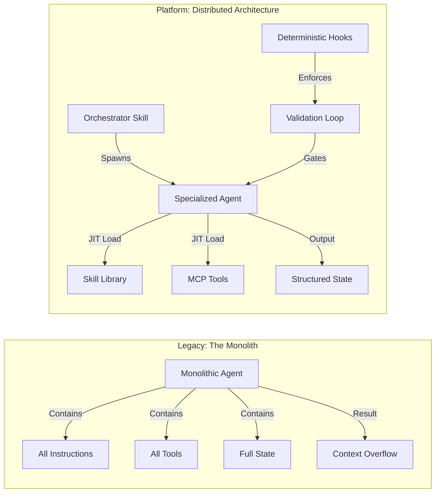
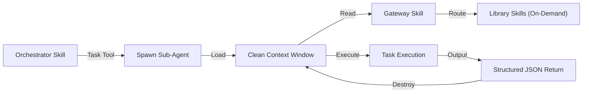
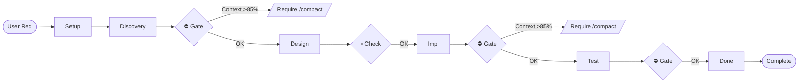
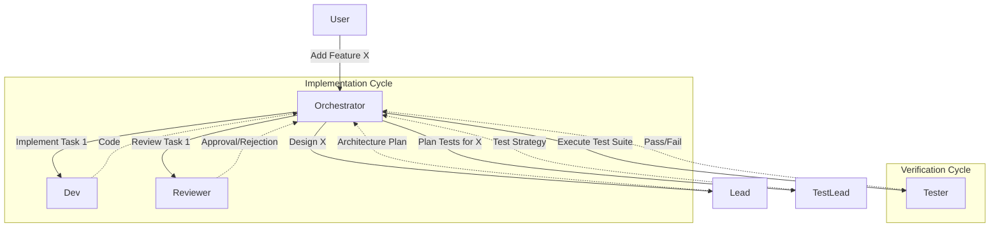
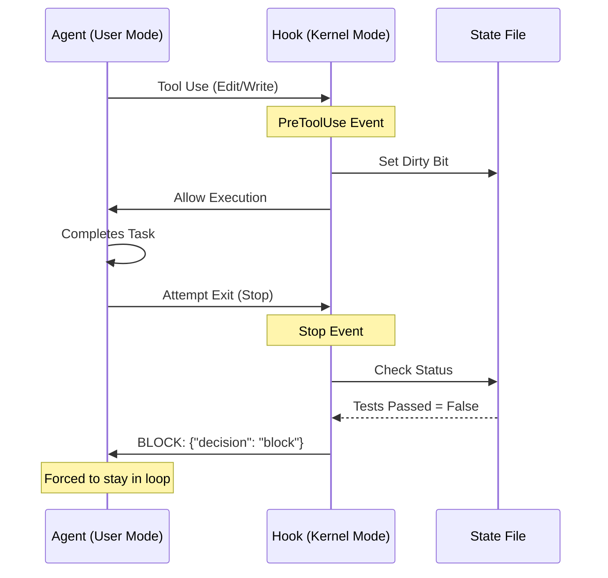
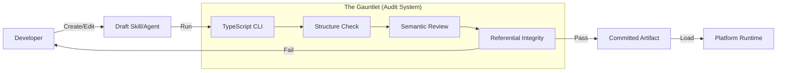
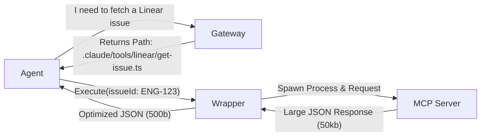

# Deterministic AI Orchestration: A Platform Architecture for Autonomous Development

## Executive Summary

The primary bottleneck in autonomous software development is not model intelligence, but context management and architectural determinism. Current "Agentic" approaches fail at scale because they rely on probabilistic guidance (prompts) for deterministic engineering tasks (builds, security, state management). Furthermore, the linear cost of token consumption versus the non-linear degradation of model attention creates a "Context Trap" that prevents complex multi-phase execution.

This paper details the architecture of the Praetorian Development Platform, which solves these problems by treating the Large Language Model (LLM) not as a chatbot, but as a nondeterministic kernel process wrapped in a deterministic runtime environment. A five-layer architecture enforces strict separation of concerns, enables linear scaling of complexity, and achieves "escape velocity"—where the AI system contributes net-positive value to the development lifecycle.

## 1. The Core Problem: The Context-Capability Paradox

Anthropic's research and internal telemetry confirm that **"token usage alone explains 80% of performance variance"** in agent tasks. This creates a fundamental paradox:

1. To handle complex tasks, agents need comprehensive instructions (skills).
2. Comprehensive instructions consume the context window.
3. Consumed context reduces the model's ability to reason about the actual task.



### Legacy vs. Platform Architecture

**Legacy: The Monolith**
- Monolithic agents contained all instructions, tools, and state
- Result: context overflow and attention dilution

**Platform: Distributed Architecture**
- Orchestrator spawns specialized agents
- Skills load just-in-time (JIT) from a library
- Deterministic hooks enforce validation loops
- Output flows through structured state management

Early iterations used "Monolithic Agents" with 1,200+ line agent bodies, suffering from **Attention Dilution** (ignoring late-stage instructions) and **Context Starvation** (insufficient space for code analysis).

### 1.1 The Solution: Inverting the Control Structure

The platform shifted from a "Thick Agent" model to a "Thin Agent / Fat Platform" architecture:

* **Agents** are reduced to stateless, ephemeral workers (<150 lines)
* **Skills** hold the knowledge, loaded strictly on-demand (Just-in-Time)
* **Hooks** provide the enforcement, operating outside the LLM's context
* **Orchestration** manages the lifecycle of specialized roles

## 2. Agent Architecture: The "Thin Agent" Pattern

### 2.1 Architectural Constraints

The architecture is defined by one hard constraint in the Claude Code runtime: **Sub-agents cannot spawn other sub-agents.** This prevents infinite recursion but necessitates a flat, "Leaf Node" execution model.

### 2.2 The "Thin Agent" Specification

Agents are specialized workers that execute specific tasks and return results. They do not manage state or coordinate workflows.

**Gold Standard Specification:**

* **Line Count:** Strictly <150 lines
* **Discovery Cost:** ~500-1000 characters (visible to the orchestrator)
* **Execution Cost:** ~2,700 tokens per spawn (down from ~24,000 in early versions)

### 2.3 Sub-Agent Isolation

Every agent spawn creates a **fresh instance** with zero shared history from previous siblings. This solves "Context Drift" where agents confuse current requirements with past attempts. The parent orchestrator selectively injects only the necessary context (e.g., the Architecture Plan) into the prompt.



## 3. Skill Architecture: Two-Tier Progressive Loading

To bypass the hard limit of ~15,000 characters for skill definitions and preserve context for thinking and execution, a two-tier (Librarian Pattern) file system architecture was implemented for agent capabilities.

### 3.1 Tier 1: Core Skills (The "BIOS")

* Location: `.claude/skills/`
* Count: 49 high-frequency skills
* Mechanism: Registered with the LLM as executable tools
* Purpose: Fundamental workflows (debugging-systematically, developing-with-tdd) and Gateways

### 3.2 Tier 2: Library Skills (The "Hard Drive")

* Location: `.claude/skill-library/`
* Count: 304+ specialized skills
* Mechanism: Invisible to the LLM until explicitly loaded via Read()
* Purpose: Deep domain knowledge (e.g., optimizing-react-performance, configuring-aws-lambda)

### 3.3 The Gateway Pattern (The Router)

Agents do not hardcode library paths. They invoke a **Gateway Skill** (e.g., `gateway-frontend`), which acts as a dynamic router based on intent detection.

**Example Gateway Routing Flow:**

```
Agent: "I need to fix a React infinite loop"
   ↓
Invokes: gateway-frontend
   ├─> Detects Intent: "infinite loop", "useEffect"
   ├─> Matches Routing Pattern:
   │    • preventing-react-hook-infinite-loops
   │    • debugging-react-infinite-loops
   └─> Output: "Read these specific file paths..."
```

This implements **Intent-Based Context Loading**, ensuring agents only load the specific patterns relevant to their current task rather than the entire domain knowledge base.

## 4. Orchestration Architecture: The Kernel

Since agents cannot spawn agents, orchestration must occur in the **Main Conversation Thread**. The Main Thread is treated as the "Kernel Mode" process, and sub-agents as "User Mode" processes.

### 4.1 The Orchestrator-Worker Pattern

The Orchestrator is a **Skill** (e.g., `orchestrating-feature-development`) running in the main thread. It holds the global state machine.

**The Tool Restriction Boundary:**

* **Orchestrator (Main Thread):** Has `Task`, `TodoWrite`, `Read`. **NO** `Edit` or `Write`
  * Constraint Enforcement: It physically cannot write code. It _must_ delegate to a worker.
* **Worker (Sub-Agent):** Has `Edit`, `Write`, `Bash`. **NO** `Task`
  * Constraint Enforcement: It physically cannot delegate. It _must_ work.

### 4.2 Coordinator vs. Executor Models

A strict separation between agents that plan and agents that do is enforced:

| Model           | Skill            | Role                | Tools       | Best For                                                  |
| --------------- | ---------------- | ------------------- | ----------- | --------------------------------------------------------- |
| **Coordinator** | orchestrating-\* | Spawns specialists  | Task        | Complex, multi-phase features requiring parallelization  |
| **Executor**    | executing-plans  | Implements directly | Edit, Write | Tightly coupled tasks requiring frequent human oversight  |

**Key Insight:** An agent cannot be both. If it has the `Task` tool (Coordinator), it is stripped of `Edit` permissions to prevent "doing it yourself." If it has `Edit` permissions (Executor), it is stripped of `Task` permissions to prevent delegation loops.

### 4.3 The Standard 16 Phase Orchestration Template

All complex workflows follow a rigorous 16-phase state machine to ensure consistency.

| Phase | Name                  | Purpose                                                  |
| ----- | --------------------- | -------------------------------------------------------- |
| 1     | Setup                 | Worktree creation, output directory, MANIFEST.yaml       |
| 2     | Triage                | Classify work type, select phases to execute             |
| 3     | Codebase Discovery    | 2 Phase Discovery. Explore patterns, detect technologies |
| 4     | Skill Discovery       | Map technologies to skills                               |
| 5     | Complexity            | Technical assessment, execution strategy                 |
| 6     | Brainstorming         | Design refinement with human-in-loop                     |
| 7     | Architecting Plan     | Technical design AND task decomposition                  |
| 8     | Implementation        | Code development                                         |
| 9     | Design Verification   | Verify implementation matches plan                       |
| 10    | Domain Compliance     | Domain-specific mandatory patterns                       |
| 11    | Code Quality          | Code review for maintainability                          |
| 12    | Test Planning         | Test strategy and plan creation                          |
| 13    | Testing               | Test implementation and execution                        |
| 14    | Coverage Verification | Verify test coverage meets threshold                     |
| 15    | Test Quality          | No low-value tests, correct assertions                   |
| 16    | Completion            | Final verification, PR, cleanup                          |

#### Compaction Gate

Before entering heavy execution phases (3, 8, 13), the system checks context usage:

* **< 75%:** Proceed
* **75-85%:** Warning (Should compact)
* **> 85%:** **Hard Block** - The system refuses to spawn new agents until `precompact-context.sh` runs

#### Intelligent Phase Skipping

Not every change needs 16 phases. Phase 2 (Triage) classifies work and skips unnecessary overhead:

| Work Type | Criteria                     | Skipped Phases                                     |
| --------- | ---------------------------- | -------------------------------------------------- |
| BUGFIX    | Single issue, clear fix      | 5, 6, 7, 9, 12 (no architecture, no brainstorming) |
| SMALL     | <100 lines, single concern   | 5, 6, 7, 9 (no complexity analysis)                |
| MEDIUM    | Multi-file, some design      | None                                               |
| LARGE     | New subsystem, architectural | All 16 phases execute                              |



**Result**: A bug fix completes in ~5 phases instead of 16. A new subsystem gets full treatment.

#### Programmatic Context Tracking

Context fullness is determined by parsing Claude Code's session transcripts:

```bash
# Session transcript location
~/.claude/projects/<project-hash>/<session-id>.jsonl

# Each line contains token counts
{
"type":"assistant",
"message":{...},
"usage":{
"cache_read":45000,
"cache_create":12000,
"input":8000
}
}

# Current context = cache_read + cache_create + input
# 200K context window → thresholds:
# 150K (75%) = SHOULD compact
# 160K (80%) = MUST compact
# 170K (85%) = Hook BLOCKS agent spawning
```

The `compaction-gate-enforcement.sh` hook reads the latest JSONL entry, calculates usage, and blocks `Task` tool calls when over threshold.

### 4.4 State Management & Locking

State is persisted to disk to survive session resets and context exhaustion.

1. **The Process Control Block** (`MANIFEST.yaml`):
   - Located in `.claude/.output/features/{id}/`
   - Tracks current phase, active agents, and validation status
   - Allows orchestration to be "resumed" seamlessly across different chat sessions

2. **Distributed File Locking:**
   - When multiple `developer` agents run in parallel, they utilize lockfile mechanisms (`.claude/locks/{agent}.lock`)
   - Prevents race conditions on shared source files

### 4.5 The Five-Role Development Pattern

Real-world application demonstrates a specialized five-role assembly line, derived from `orchestrating-multi-agent-workflows`. This pattern ensures distinct cognitive modes remain isolated and unpolluted.

| Role                      | Agent        | Responsibility                                                                                            | Output                   |
| ------------------------- | ------------ | --------------------------------------------------------------------------------------------------------- | ------------------------ |
| **Specialized Lead**      | \*-lead      | **Architecture & Strategy.** Decomposes requirements into atomic tasks. Does not write code.              | Architecture Plan (JSON) |
| **Specialized Developer** | \*-developer | **Implementation.** Executes specific sub-tasks from the plan. Focuses purely on logic.                   | Source Code              |
| **Specialized Reviewer**  | \*-reviewer  | **Compliance.** Validates code against specs and patterns. Rejects non-compliant work.                    | Review Report            |
| **Test Lead**             | test-lead    | **Strategy.** Analyzes the implementation to determine _what_ needs testing (Unit vs E2E vs Integration). | Test Plan                |
| **Specialized Tester**    | \*-tester    | **Verification.** Writes and runs the tests defined by the Test Lead.                                     | Test Cases               |



#### The Workflow

```
User → Orchestrator → Lead designs
          ↓
      Dev implements → Reviewer validates
          ↓
      TestLead plans → Tester verifies
          ↓
      Complete
```

This specialization prevents the "Jack of All Trades" failure mode.

### 4.6 Orchestration Skills: The Coordination Infrastructure

The 16-phase template defines _what_ happens; orchestration skills define _how_ agents achieve autonomous completion without human intervention at every step.

#### The Iteration Problem

The `iterating-to-completion` skill solves iteration challenges with three mechanisms:

1. **Completion Promises:** An explicit string (e.g., `ALL_TESTS_PASSING`, `IMPLEMENTATION_COMPLETE`) that the agent outputs _only_ when success criteria are met. The orchestrator pattern-matches for this signal—no fuzzy interpretation.

2. **Scratchpads:** A persistent file (`.claude/.output/scratchpad-{task}.md`) where agents record what they accomplished, what failed, and what to try next. Each iteration reads the scratchpad first, preventing the "Groundhog Day" failure.

3. **Loop Detection:** If three consecutive iterations produce outputs with >90% string similarity, the system detects a stuck state and escalates rather than burning tokens.

#### The Persistence Problem

The `persisting-agent-outputs` and `persisting-progress-across-sessions` skills provide external memory:

* **Discovery Protocol:** When an agent spawns, it doesn't guess where to write. It follows a deterministic protocol: check for `OUTPUT_DIRECTORY` in the prompt → find recent `MANIFEST.yaml` files → create a new directory only if none exist.

* **Blocked Agent Routing:** When an agent returns `status: "blocked"` with a `blocked_reason`, the orchestrator consults a routing table to determine the next action—escalate to user, spawn a different agent, or abort.

* **Context Compaction:** As workflows progress, completed phase outputs are summarized to prevent "context rot"—the degradation in model performance as the window fills with stale information.

#### The Parallelization Problem

When six tests fail across three files, sequential debugging wastes time. The `dispatching-parallel-agents` skill identifies _independent_ failures:

```
Agent 1 (frontend-tester) → Fix auth-abort.test.ts (3 failures)
Agent 2 (frontend-tester) → Fix batch-completion.test.ts (2 failures)
Agent 3 (frontend-tester) → Fix race-conditions.test.ts (1 failure)
```

All three run simultaneously. When they return, the orchestrator verifies no conflicts and integrates the fixes. Time to resolution: 1x instead of 3x.

#### Skill Composition

Skills compose hierarchically:

```
orchestrating-feature-development (16-phase workflow)
    ├── persisting-agent-outputs (shared workspace)
    ├── persisting-progress-across-sessions (cross-session resume)
    ├── iterating-to-completion (intra-task loops)
    └── dispatching-parallel-agents (concurrent debugging)
```

## 5. The Runtime: Deterministic Hooks

While Skills provide guidance, **Hooks provide enforcement**. The Claude Code lifecycle events (`PreToolUse`, `PostToolUse`, `Stop`) inject deterministic logic that the LLM cannot bypass.

### 5.1 Defense in Depth: Eight-Layer Enforcement

Any single enforcement mechanism can fail. The architecture assumes failure at every layer and compensates with overlapping enforcement.

| Layer                           | Description                                                               |
| ------------------------------- | ------------------------------------------------------------------------- |
| LAYER 1: CLAUDE.md              | Full ruleset loaded at session start. Establishes norms.                  |
| LAYER 2: Skills                 | Procedural workflows invoked on-demand. "How to do X."                    |
| LAYER 3: Agent Definitions      | Role-specific behavior, mandatory skill lists, output formats.            |
| LAYER 4: UserPromptSubmit Hooks | Inject reminders every prompt. Gateway → library skill pattern.           |
| LAYER 5: PreToolUse Hooks       | Block BEFORE action. Agent-first enforcement, compaction gates.           |
| LAYER 6: PostToolUse Hooks      | Validate agent work before completion. Output location, skill compliance. |
| LAYER 7: SubagentStop Hooks     | Block premature exit. Quality gates, iteration limits, feedback loops.    |
| LAYER 8: Stop Hooks             | Block premature exit. Quality gates, iteration limits, feedback loops.    |

#### Example

A developer agent writes code without spawning a reviewer:

| Layer | Mechanism                                                       | Catches?          |
| ----- | --------------------------------------------------------------- | ----------------- |
| 3     | Agent definition says "reviewer validates your work"            | Rationalized      |
| 6     | `track-modifications.sh` creates feedback-loop-state.json       | State initialized |
| 8     | `feedback-loop-stop.sh` blocks exit until review phase passes   | **Blocked**       |
| 8     | `quality-gate-stop.sh` provides backup check                    | **Blocked**       |

The agent ignored Layer 3 guidance. Layers 6 and 8 caught it anyway.

### 5.2 Agent-First Enforcement

The platform doesn't suggest delegation—it *forces* it.

```bash
# PreToolUse hook intercepts Edit/Write
agent-first-enforcement.sh

1. Parse tool_input.file_path
2. Determine domain (backend, frontend, capability, tool)
3. Check if developer agent exists for that domain
4. If yes → BLOCK with: "Spawn {domain}-developer instead"
```

**Before (rationalized):**
```
User: "Fix the authentication bug in login.go"
Claude: "I'll just make this quick edit myself..."
→ Writes buggy code, no review, no tests
```

**After (enforced):**
```
User: "Fix the authentication bug in login.go"
Claude: Attempts Edit on login.go
→ BLOCKED: "backend-developer exists. Spawn it instead of editing directly."
Claude: Spawns backend-developer with clear task
→ Agent follows TDD, gets reviewed, tests pass
```

### 5.3 The Three-Level Loop System

Three nested enforcement loops guarantee quality. Limits are defined in a central configuration file: `.claude/config/orchestration-limits.yaml`. This "Configuration as Code" approach allows tuning system behavior without modifying underlying shell scripts.

**Level 1: Intra-Task Loop** (Hook: `iteration-limit-stop.sh`)

* **Scope:** Single agent
* **Function:** Prevents an agent from spinning endlessly on a single shell command
* **Limit:** Max 10 iterations (configurable)

**Level 2: Inter-Phase Loop** (Hook: `feedback-loop-stop.sh`)

* **Scope:** The Implementation → Review → Test cycle
* **Function:** Enforces that code _cannot_ be marked complete until independent Reviewer and Tester agents have passed it
* **Logic:**
  1. Listens for `Edit`/`Write` tools
  2. Sets a "Dirty Bit" in `feedback-loop-state.json`
  3. Intercepts `Stop` event
  4. If Dirty Bit is set and `tests_passed != true`, **BLOCK EXIT**
  5. Returns JSON: `{"decision": "block", "reason": "Tests failed. You must fix and retry."}`



##### Multi-Domain Feedback Loops

Real changes often span multiple domains. Feedback loop tracks phases **per domain**:

```json
{
  "active": true,
  "iteration": 2,
  "modified_domains": ["backend", "frontend"],
  "domain_phases": {
    "backend": {
      "review": { "status": "PASS", "agent": "backend-reviewer" },
      "testing": { "status": "PASS", "agent": "backend-tester" }
    },
    "frontend": {
      "review": { "status": "PASS", "agent": "frontend-reviewer" },
      "testing": { "status": "FAIL", "agent": "frontend-tester" }
    }
  }
}
```

**Behavior:**
- Exit blocked until ALL domains pass ALL phases
- If any domain's tests fail, ALL domains reset for next iteration
- Domain-specific agents ensure expertise match (Go reviewers for Go code)

**Level 3: Orchestrator Loop** (Skill Logic)

* **Scope:** The 16-phase workflow
* **Function:** Re-invokes entire phases if macro-goals are missed

### 5.4 Ephemeral vs. Persistent State

A dual-state architecture ensures resilience:

* **Ephemeral State (Hooks):** Stored in `feedback-loop-state.json`. Used for **Runtime Enforcement** (blocking exit, tracking dirty bits). Cleared on session restart.

* **Persistent State (Agents):** Stored in `MANIFEST.yaml`. Used for **Workflow Coordination** (resuming tasks, tracking phases). Survives session restarts.

If a session crashes (losing ephemeral state), the workflow can still be resumed from the last checkpoint using the persistent manifest.

### 5.5 The Escalation Advisor

When an agent gets stuck in a loop, standard retries fail. An **Out-of-Band Advisor** is employed.

* **Trigger:** `Stop` event blocked > 3 times
* **Action:** The hook invokes an external LLM (Gemini or Codex) with the session transcript
* **Prompt:** "Analyze this loop. Why is the agent stuck? Provide a 1-sentence hint."
* **Result:** The hint is injected into the main context as a system message, breaking the cognitive deadlock

### 5.6 Output Location Enforcement

Agents should write outputs to `.claude/.output/` following the `persisting-agent-outputs` skill. However, agents can skip skills. We have multiple enforcement layers:

**LAYER 1: PostToolUse (Task) – FEEDBACK**

`task-skill-enforcement.sh`
- Warns if agent didn't invoke persisting-agent-outputs
- Non-blocking feedback to orchestrator

**LAYER 2: SubagentStop – BLOCKING**

`output-location-enforcement.sh`
- Detects untracked .md files outside `.claude/.output/`
- Checks skill compliance in file content
- Analyzes git state for safe vs manual revert
- **BLOCKS** completion if violations found

**LAYER 3: Stop – DEFENSE IN DEPTH**

`quality-gate-stop.sh`
- Same detection as Layer 2
- Catches anything that slipped through SubagentStop

When violations are detected, the hook provides actionable remediation:

```
SKILL COMPLIANCE FAILURE DETECTED

Files written to wrong location:
- agent-output.md: Missing persisting-agent-outputs in skills_invoked

REQUIRED ACTIONS:
1. DELETE: rm "agent-output.md"
2. SAFE REVERT: git checkout -- "new-file.ts"
3. MANUAL REVIEW: shared-file.ts (has prior uncommitted changes)
4. RE-DO with proper skill compliance
```

### 5.7 Related Work & Architectural Evolution

The architecture synthesizes and extends two foundational patterns from the Claude ecosystem:

1. **Ralph Wiggum** (Geoffrey Huntley): A "dumb" `while` loop that restarts an agent until completion. Formalized into the **Intra-Task Loop** with configuration, loop detection, and safety guards.

2. **Continuous-Claude-v3** (parcadei): A "persistence" pattern using YAML handoffs to survive session resets. Adopted for **Persistent State** (`MANIFEST.yaml`) with distributed locking and hooks.

3. **Superpowers** (Jesse Vincent): An agentic skills framework emphasizing TDD, YAGNI, and sub-agent driven development. Adopted "Brainstorming" and "Writing Plans" skills as foundation for Setup and Discovery phases.

| Feature      | Ralph Wiggum      | Continuous-Claude-v3  | Superpowers     | Praetorian Development Platform                       |
| ------------ | ----------------- | --------------------- | --------------- | ----------------------------------------------------- |
| **Scope**    | Single Agent Loop | Cross-Session Handoff | Skill Framework | Multi-Agent Orchestration                             |
| **State**    | None (Loop only)  | YAML Handoffs         | Context-based   | Dual (Ephemeral + Persistent)                         |
| **Control**  | Prompt-based      | Prompt-based          | Skill-based     | Deterministic Hooks                                   |
| **Feedback** | None              | None                  | Human-in-loop   | Inter-Phase Loops + Escalation Advisor (Independent LLM) |

The unique contribution is the **Inter-Phase Feedback Loop** (Implementation → Review → Test), which enforces quality gates across _multiple specialized agents_.

## 6. The Supply Chain: Lifecycle Management

Managing 350+ prompts and 39+ specialized agents leads to entropy. These assets are treated as software artifacts, managed by dedicated TypeScript CLIs.



### 6.1 The Agent Manager

Every agent definition must pass checks via the Agent Manager (`.claude/commands/agent-manager.md`).

* **The 9-Phase Agent Audit:** Every agent definition must pass checks for:
  * **Leanness:** Strictly <150 lines (or <250 for architects)
  * **Discovery:** Valid "Use when" triggers for the Task tool
  * **Skill Integration:** Proper Gateway usage instead of hardcoded paths
  * **Output Standard:** JSON schema compliance for structured handoffs

### 6.2 The Skill Manager & TDD

Test-Driven Development applies to prompt engineering, managed by the Skill Manager.

**The 28-Phase Skill Audit System:**

Every skill must pass a 28-point automated audit before commit:

* **Structural:** Frontmatter validity, file size (<500 lines)
* **Semantic:** Description signal-to-noise ratio
* **Referential:** Integrity of all `Read()` paths and Gateway linkages

**The Hybrid Audit Pattern:**

Uses a **Cyborg Approach**, combining:

1. **Deterministic CLI Checks:** Using TypeScript ASTs to verify file structures, link validity, and syntax
2. **Semantic LLM Review:** Using a "Reviewer LLM" to judge clarity, tone, and utility

This ensures technical correctness _and_ human utility.

**TDD for Prompts (Red-Green-Refactor):**

1. **Red:** Capture a transcript where an agent fails
2. **Green:** Update the skill/hook until the behavior is corrected
3. **Refactor:** Run "Pressure Tests" with adversarial system prompts to ensure hooks hold firm

### 6.3 The Research Orchestrator: Content Accuracy

While TDD ensures _structural_ correctness, it cannot guarantee _semantic_ accuracy. The `orchestrating-research` skill is employed.

**The Research-First Workflow:**

Before a skill's content is written (the "Green" phase), the system spawns specialized research orchestration:

1. **Intent Expansion:** The `translating-intent` skill breaks the topic into semantic interpretations
2. **Sequential Discovery:** Agents dispatch to 6 distinct sources:
   * **Codebase:** Existing patterns in the repo
   * **Context7:** Official library documentation
   * **GitHub:** Community usage and issues
   * **Web/Perplexity:** Current best practices
3. **Synthesis:** A final pass aggregates findings, resolves conflicts between sources, and generates the `SKILL.md` content

This ensures every skill is grounded in ground-truth documentation and actual codebase usage.

## 7. Tooling Architecture: Progressive MCPs & Code Intelligence

Skills manage _behavioral_ context, while MCP Tools manage _functional_ context. Standard MCP implementations suffer from two compounding inefficiencies:

1. **Eager Loading:** Tool definitions (~20k tokens) are injected at startup—roughly 10% of a 200k token window consumed before the agent receives any task
2. **Context Rot:** Every intermediate tool result replays back into the model's context

Anthropic's measurements show standard MCP workflows consuming **~150k tokens** for multi-tool operations that could execute in **~2k tokens** with proper architecture—a 98% reduction.

### 7.1 The TypeScript Wrapper Pattern (aka MCP Code Execution)

Raw MCP connections were replaced with **On-Demand TypeScript Wrappers**.

* **Legacy Model:** 5 MCP servers = **71,800 tokens** consumed at startup (36% of context)
* **Wrapper Model:** **0 tokens** at startup. Wrappers load via the Gateway pattern only when requested
* **Safety Layer:** Wrappers enforce **Zod schema validation** on inputs and **Response Filtering** on outputs, preventing "context flooding"

**Execution Flow:**

```
Session Start: 0 Tokens Loaded

Agent → Gateway: "I need to fetch a Linear issue"
   ↓
Gateway → Agent: Returns Path: .claude/tools/linear/get-issue.ts
   ↓
Agent → Wrapper: Execute(issueId: "ENG-123")
   ↓ (Zod Validation)
Wrapper → MCP: Spawn Process & Request
   ↓
MCP → Wrapper: Large JSON Response (50kb)
   ↓ (Response Filtering)
Wrapper → Agent: Optimized JSON (500b)

Process Ends. Memory Freed.
```



### 7.2 Serena: Semantic Code Intelligence

While MCP wrappers solve _tool definition_ bloat, code operations present a larger token sink. Standard workflows require reading entire files to understand structure, then performing grep-like searches that return irrelevant context.

**The File-Reading Problem:**

Consider an agent modifying a single function in a 2,000-line file:

* **Traditional Approach:** Read full file (~8,000 tokens) → Find function via regex → Generate replacement → Write full file. For 5 related files, that's **~40,000 tokens** just for context.
* **Symbol-Level Approach:** Query `find_symbol("processPayment")` → Returns only the function body (~200 tokens) → Edit at symbol level. Same 5-file task uses **~1,000 tokens**.

**Serena Integration** (an open-source MCP toolkit with 19k+ GitHub stars) provides IDE-like capabilities via Language Server Protocol (LSP):

| Operation                | Without Serena                    | With Serena                                   |
| ------------------------ | --------------------------------- | --------------------------------------------- |
| Find function definition | Read entire file(s), regex search | find_symbol → exact location                 |
| Trace call hierarchy     | Read all potential callers        | find_referencing_symbols → direct graph     |
| Insert new method        | Read file, string manipulation    | insert_after_symbol → surgical placement    |
| Navigate dependencies    | Grep + manual file traversal      | find_symbol on imports → semantic resolution |

**Performance Optimization:** A custom **Connection Pool** architecture maintains warm LSP processes, reducing query latency from ~3s cold-start to ~2ms warm, enabling high-frequency code queries without process spawn overhead.

## 8. Infrastructure Integration: Zero-Trust Secrets

Injecting secrets (AWS keys, Database credentials) into the LLM context is a critical security vulnerability. A **Just-in-Time (JIT) Injection** architecture using 1Password was implemented.

### 8.1 The run-with-secrets Wrapper

Agents are not given API keys. They are given a tool: `1password.run-with-secrets`.

**Configuration** (`.claude/tools/1password/lib/config.ts`):

```typescript
export const DEFAULT_CONFIG = {
  account: "praetorianlabs.1password.com",
  serviceItems: {
    "aws-dev": "op://Private/AWS Key/credential",
    "ci-cd": "op://Engineering/CI Key/credential",
  },
};
```

**Execution Flow:**

```
LLM Context → Agent: "List S3 Buckets"
   ↓
Agent → Tool: run_with_secrets("aws s3 ls")
   ↓
┌─────────────────────────────────┐
│ SECURE ENCLAVE (Child Process)  │
│ Tool → 1Password: Request Key   │
│ 1Password → Tool: Inject as ENV │
│ Tool → AWS CLI: Execute Command │
│ AWS CLI → Tool: Output Results  │
└─────────────────────────────────┘
   ↓
Tool → Agent: Return Output
   ↓
Agent → LLM: "Here are the buckets..."

SECRET NEVER ENTERED CONTEXT
```

**Security Guarantee:** The secret exists _only_ in the child process environment variables. It is never printed to stdout, never logged, and never enters the LLM context window.

## 9.0 Horizontal Scaling Architecture

Traditional software development is constrained by human limitation and local hardware. To remove this bottleneck, the **Control Plane** (Laptop) was decoupled from the **Execution Plane** (Cloud).

* **Local:** Engineer's laptop deploys a Docker instance using DevPod, loaded with development environment (Cursor, Claude Code, GitHub Repository)
* **Remote:** The actual development environment ("DevPod") runs in an ephemeral Docker container within an AMI; building and deploying occurs in the cloud
* **Bridge:** A secure SSH tunnel forwards the remote Cursor terminal back to the developer's laptop

### 9.1 DevPod, Docker, and AWS AMIs

Because heavy lifting happens in the cloud, engineers can spawn **infinite parallel DevPods**:

* **Isolation:** Each feature or threat model runs in its own isolated container
* **Resources:** Provision 128GB RAM instances for massive monorepo analysis, impossible on a laptop
* **Security:** Code never leaves the VPC. The laptop only sees the terminal pixels/text stream

## 10.0 Roadmap: Beyond Orchestration

The current platform achieves Level 3 Autonomy (Orchestrated). The roadmap targets Level 5 (Self-Evolving).

### 10.1 Heterogeneous LLM Routing

No single model excels at every task. A routing matrix sends specific tasks to the models best architected to handle them. This "Heterogeneous Orchestration" optimizes for both performance and cost.

A semantic decision layer uses small, fast models as routers. These routers evaluate the user's intent and select the appropriate specialist agent, ensuring expensive reasoning models are reserved for logic, while high-throughput multimodal models handle visual and data-heavy tasks.

| Development Task               | Optimal Model Architecture | Technical Advantage                                                            |
| ------------------------------ | -------------------------- | ------------------------------------------------------------------------------ |
| **Logic & Reasoning**          | DeepSeek-R1 / V3           | Reinforcement Learning (RL)-based chain-of-thought for complex inference      |
| **Document Processing**        | DeepSeek OCR 2             | 10x token efficiency utilizing visual causal flow for structural preservation |
| **UI/UX & Frontend**           | Kimi 2.5                   | Native MoonViT architecture; enables autonomous visual debugging loops        |
| **Parallel Research**          | Kimi 2.5 Swarm             | PARL-driven optimization of the critical path across up to 100 agents         |
| **Massive Repository Mapping** | DeepSeek-v4 Engram         | O(1) constant-time lookup and tiered KV cache for million-token context      |

### 10.2 Self-Annealing & Auto-Correction (Q1 2026)

Current autonomous systems are brittle. When an agent fails due to ambiguity in a skill or loophole in a hook, the human must debug the prompt engineering. This loop is being closed by enabling the platform to **debug and patch itself**.

**The Concept:**

When an agent fails a quality gate more than 3 times, or when an orchestrator detects a pattern of tool misuse, a **Self-Annealing Workflow** is triggered.

**The Mechanism:**

Instead of returning the error to the user, the platform spawns a **Meta-Agent** (infrastructure engineer agent) with permissions to modify the `.claude/` directory.

1. **Diagnosis:** The Meta-Agent reads the session transcript and failed agent's definition. It identifies the "Rationalization Path"—the specific chain of thought the agent used to bypass instructions.

2. **Patching:**
   * **Skill Annealing:** Modifies the relevant `SKILL.md` to add an explicit "Anti-Pattern" entry
   * **Hook Hardening:** If a hook failed to block a violation, updates the bash script logic
   * **Agent Refinement:** Updates the agent's prompt to clarify the ambiguous instruction

3. **Verification:** Runs the `pressure-testing-skill-content` skill against the patched artifact

4. **Pull Request:** The Meta-Agent creates a PR with the infrastructure fix, labeled `[Self-Annealing]`, for human review

This transforms the platform from a static set of rules into an **antifragile system** that gets stronger with every failure.

### 10.3 Agent-to-Agent Negotiation (Q2 2026)

Currently, agents follow rigid JSON schemas. Future agents will negotiate API contracts dynamically:

* "I need X, can you provide it?"
* "No, but I can provide Y which is similar."
* "Agreed, proceeding with Y."

### 10.4 Self-Healing Infrastructure (Q2 2026)

Agents will gain the ability to debug their own runtime environment:

* Detecting "Context Starvation" and auto-archiving memory
* Identifying "Tool Hallucination" and generating new Zod schemas to fix it

## 11.0 Conclusion

The Praetorian Development Platform achieves escape velocity not by "improving the model," but by constraining the runtime. By architecting a system where agents are ephemeral, context is curated via gateways, and workflows are enforced by deterministic hooks, AI becomes a deterministic component of the software supply chain.

### 11.1 Recap

By architecting a system where:

1. **Agents** are ephemeral and stateless
2. **Context** is strictly curated via Gateways
3. **Workflows** are enforced by deterministic Kernel hooks
4. **Tools** are progressively loaded and type-safe
5. **Secrets** never touch the context

We transform the LLM from a "creative assistant" into a **deterministic component of the software supply chain**. This allows development throughput to scale linearly with compute, untethered by the cognitive limits of human attention.

### 11.2 Constraint Forces Innovation

For the next 12 weeks, one attack module per week is being open sourced as part of "The 12 Caesars" marketing campaign. The AI attack platform architecture applies similar principles to development architecture, allowing circumvention of capital-light footprints that would ordinarily limit execution capability. Like DeepSeek's proof regarding frontier models, the expensive approach may not be optimal anymore. The problem with abundant capital is that it allows rapid execution of suboptimal solutions. With constrained resources, cleverness becomes essential.

**Build the machine, that builds the machine, that enables a team, to hack all the things.**

## 12.0 References

**Anthropic Official Guidance:**

* [Building Effective Agents](https://www.anthropic.com/research/building-effective-agents)
* [Multi-Agent Research System](https://www.anthropic.com/engineering/multi-agent-research-system)
* [Effective Context Engineering](https://www.anthropic.com/engineering/effective-context-engineering-for-ai-agents)
* [Claude Code Sub-agents](https://code.claude.com/docs/en/sub-agents)
* [Agent Skills Best Practices](https://platform.claude.com/docs/en/agents-and-tools/agent-skills/best-practices)
* [Claude Code Hooks Reference](https://docs.anthropic.com/en/docs/claude-code/hooks)

**Community & Open Source:**

* [Ralph Wiggum Technique](https://awesomeclaude.ai/ralph-wiggum) – Completion promises, intra-task loops
* [ralph-orchestrator](https://github.com/mikeyobrien/ralph-orchestrator) – Tight feedback loops, scratchpad pattern
* [Continuous-Claude-v3](https://github.com/parcadei/Continuous-Claude-v3) – YAML handoffs, memory system
* [obra/superpowers](https://github.com/obra/superpowers) – REQUIRED SUB-SKILL pattern, Integration sections
* [Serena](https://github.com/oraios/serena) – Semantic code analysis via LSP
* [Context Parallelism](https://www.agalanov.com/notes/efficient-claude-code-context-parallelism-sub-agents/) – File scope boundaries, proactive conflict prevention

**Standards & Protocols:**

* [Model Context Protocol (MCP)](https://modelcontextprotocol.io)
* [Language Server Protocol (LSP)](https://microsoft.github.io/language-server-protocol/)
* [MCP Security Model](https://modelcontextprotocol.io/docs/concepts/security)

## About the Authors

**Nathan Sportsman** — Founder and CEO of Praetorian. He holds a BS in Electrical and Computer Engineering from the University of Texas at Austin.
