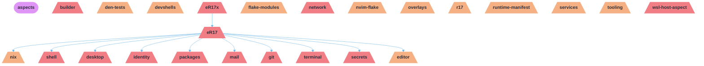
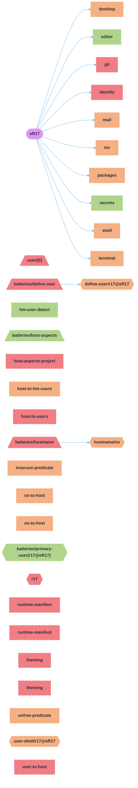
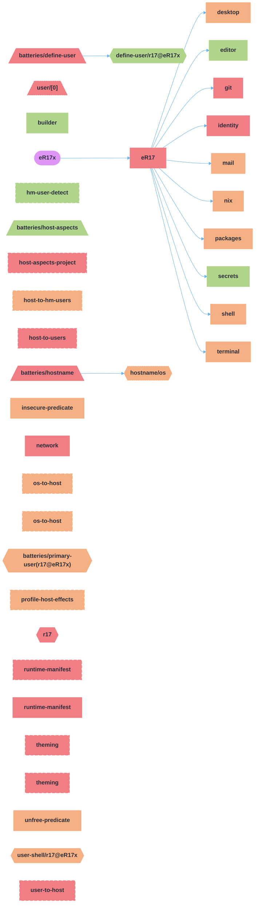
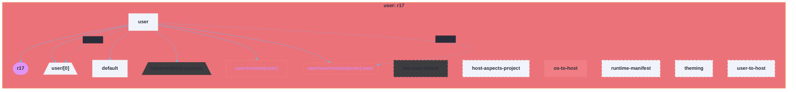
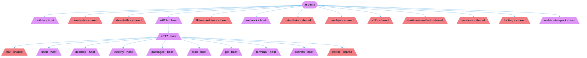

<div align="center">
    <h1>R17{x} Universe ❄️</h1>
    <br>
    <div align="center">
        <a href="https://github.com/r17x/universe/stargazers">
            
        </a>
        <a href="https://github.com/r17x/universe/">
            
        </a>
        <a href="https://nixos.org">
            
        </a>
        <a href="https://github.com/r17x/universe/blob/main/LICENSE">
            
        </a>
    </div>
    <br>
</div>

## Motivation

(DRY) - Don't repeat yourself is a principle in software development. We should use this principle to reduce repetitive and time-consuming work. Personally, I just try to apply this principle in my professional and personal work. The most basic example is making these dotfiles, so that I don't have to provide the needs of the devices or tools used in everyday life. So, from this motivation you can see the main goal (Goal).

The work of a software developer, software engineer, or software laborer requires tools that are used on top of a running system (termed an operating system or OS). I am familiar with using operating systems such as OSX based on Darwin/Unix made by Apple and ArchLinux based on Linux. Well my goal is to become a human user agnostic (not religiously attached to a system but still loyal to the creator of the user, except for the operating system made by Mikocok). The tools are collected in one place to store everything about tools, configurations, settings, credentials, and others that support the needs of working or just operating a computer. Where is my container? In this github, then we need git or other tools, which is clear that we stay in sync between each machine we use so that we don't do repetitive things.

To keep it pure and the same between each machine, I decided to use Nix.

## Nix

Nix is a "purely functional package manager", the Nix experience is completely different than other package managers. For some people it may seem complicated to use, but it is worth it if you understood what you really need.

If you have ever used the "virtual env" tool popular in the "python" ecosystem then you can experience the same thing but across operating systems, platforms, and programming language ecosystems.

Since nix uses functional concepts like declarative then it should be utilized well. such as declaring needs and then declaring with nix language.

<hr/>

> Heavily inspired from ([malob/nixpkgs](https://github.com/malob/nixpkgs)) (especially [in v1](https://github.com/r17x/universe/tree/v1))

This is my personal configuration with [nix](https://nixos.org/) using [**flakes**](https://nixos.wiki/wiki/Flakes), [**flake.part**](https://flake.parts/), [**home-manager**](https://github.com/nix-community/home-manager), & [**nix-darwin**](https://github.com/LnL7/nix-darwin) for Darwin or MacOS System.

## What's Inside

**R17{x} Universe** is my personal λ-powered development sanctuary - a comprehensive Nix-based configuration that brings together all the tools, configs, and digital spirits I need for daily wizard work. Think of it as a purely functional approach to avoiding the "works on my machine" curse across all my devices.

### Core Philosophy 

Just like how every good wizard knows that having the name of a spirit gives you power over it, this configuration gives me power over my development environment. Whether I'm brewing OCaml potions, crafting ReasonML spells, or tinkering with meta-programming μagic, everything stays consistent across macOS and Linux realms.

### What Makes This Special

- **λ Programming Environment**: Custom setups for functional programming languages with focus on ReasonML/OCaml/ReScript, JavaScript/TypeScript, Nix, and magic stuff.
- **AI-Enhanced Neovim**: Because even wizards need intelligent assistants for their code conjuring
- **Cross-Platform Consistency**: Works seamlessly on both Darwin (macOS) and Linux systems
- **Personal Knowledge Base**: Integrated note-taking with [`.norg`](https://github.com/nvim-neorg/neorg) format for documenting discoveries
- **Secret Management**: [SOPS](https://getsops.io/) and [Pass](https://www.passwordstore.org/) integration for keeping the important stuff encrypted
- **Developer Experience (D.x)**: Everything optimized for smooth development workflows

### The Technical Stack

- **[Den](https://github.com/denful/den)**: Aspect-oriented configuration framework — aspects, entities, policies, and schema
- **Nix Flakes**: For pure, reproducible environments that actually work
- **Home Manager**: Managing user-space configurations without the chaos
- **Nix-Darwin**: macOS system configuration that doesn't make you cry
- **NixOS**: Linux configurations for VMs and containers
- **Custom Development Shells**: Pre-configured environments for various languages and tools

## Graph

<!-- BEGIN:AUTO-GENERATED -->

### Overview


```mermaid
%%{init: {"theme":"base","themeVariables":{"activationBkgColor":"#EC7279","activationBorderColor":"#EF9F76","actorBkg":"#EC7279","actorBorder":"#6CB6EB","actorLineColor":"#6CB6EB","actorTextColor":"#D38AEA","background":"#2B2D3A","classText":"#D38AEA","clusterBkg":"#EC7279","clusterBorder":"#EF9F76","edgeLabelBackground":"#2B2D3A","labelBoxBkgColor":"#EC7279","labelBoxBorderColor":"#6CB6EB","labelTextColor":"#D38AEA","lineColor":"#6CB6EB","loopTextColor":"#D38AEA","mainBkg":"#EC7279","nodeBkg":"#EC7279","nodeBorder":"#6CB6EB","nodeTextColor":"#D38AEA","noteBkgColor":"#EC7279","noteBorderColor":"#EF9F76","noteTextColor":"#D38AEA","pie1":"#3D3D40","pie2":"#F17E84","pie3":"#B1D48B","pie4":"#F5B083","pie5":"#7EC1F5","pie6":"#DE95F5","pie7":"#68C7CD","pie8":"#F0F4FA","pieLegendTextColor":"#D38AEA","pieOuterStrokeColor":"#EF9F76","pieSectionTextColor":"#D38AEA","pieStrokeColor":"#EF9F76","pieTitleTextColor":"#D38AEA","primaryBorderColor":"#6CB6EB","primaryColor":"#EC7279","primaryTextColor":"#D38AEA","secondBkg":"#EC7279","secondaryBorderColor":"#EF9F76","secondaryColor":"#EC7279","secondaryTextColor":"#D38AEA","sequenceNumberColor":"#2B2D3A","signalColor":"#6CB6EB","signalTextColor":"#D38AEA","tertiaryBorderColor":"#EF9F76","tertiaryColor":"#EC7279","tertiaryTextColor":"#D38AEA","textColor":"#D38AEA","titleColor":"#D38AEA"}}}%%
graph TD
  aspects([aspects]):::root
  builder[/"builder"\]:::builder_c
  den_tests[/"den-tests"\]:::den_tests_c
  desktop[/"desktop"\]:::desktop_c
  devshells[/"devshells"\]:::devshells_c
  eR17[/"eR17"\]:::eR17_c
  eR17x[/"eR17x"\]:::eR17x_c
  editor[/"editor"\]:::editor_c
  flake_modules[/"flake-modules"\]:::flake_modules_c
  git[/"git"\]:::git_c
  identity[/"identity"\]:::identity_c
  mail[/"mail"\]:::mail_c
  network[/"network"\]:::network_c
  nix[/"nix"\]:::nix_c
  nvim_flake[/"nvim-flake"\]:::nvim_flake_c
  overlays[/"overlays"\]:::overlays_c
  packages[/"packages"\]:::packages_c
  r17[/"r17"\]:::r17_c
  runtime_manifest[/"runtime-manifest"\]:::runtime_manifest_c
  secrets[/"secrets"\]:::secrets_c
  services[/"services"\]:::services_c
  shell[/"shell"\]:::shell_c
  terminal[/"terminal"\]:::terminal_c
  tooling[/"tooling"\]:::tooling_c
  wsl_host_aspect[/"wsl-host-aspect"\]:::wsl_host_aspect_c

  eR17 --> nix
  eR17 --> shell
  eR17 --> desktop
  eR17 --> identity
  eR17 --> packages
  eR17 --> mail
  eR17 --> git
  eR17 --> terminal
  eR17 --> secrets
  eR17 --> editor
  eR17x --> eR17

  classDef root fill:#DE95F5,stroke:#DE95F5,color:#2B2D3A,font-weight:bold
  classDef builder_c fill:#F17E84,stroke:#F17E84,color:#2B2D3A,stroke-width:2px
  classDef den_tests_c fill:#F5B083,stroke:#F5B083,color:#2B2D3A,stroke-width:2px
  classDef desktop_c fill:#F17E84,stroke:#F17E84,color:#2B2D3A,stroke-width:2px
  classDef devshells_c fill:#F5B083,stroke:#F5B083,color:#2B2D3A,stroke-width:2px
  classDef eR17_c fill:#F17E84,stroke:#F17E84,color:#2B2D3A,stroke-width:2px
  classDef eR17x_c fill:#F17E84,stroke:#F17E84,color:#2B2D3A,stroke-width:2px
  classDef editor_c fill:#F5B083,stroke:#F5B083,color:#2B2D3A,stroke-width:2px
  classDef flake_modules_c fill:#F5B083,stroke:#F5B083,color:#2B2D3A,stroke-width:2px
  classDef git_c fill:#F17E84,stroke:#F17E84,color:#2B2D3A,stroke-width:2px
  classDef identity_c fill:#F17E84,stroke:#F17E84,color:#2B2D3A,stroke-width:2px
  classDef mail_c fill:#F17E84,stroke:#F17E84,color:#2B2D3A,stroke-width:2px
  classDef network_c fill:#F17E84,stroke:#F17E84,color:#2B2D3A,stroke-width:2px
  classDef nix_c fill:#F5B083,stroke:#F5B083,color:#2B2D3A,stroke-width:2px
  classDef nvim_flake_c fill:#F5B083,stroke:#F5B083,color:#2B2D3A,stroke-width:2px
  classDef overlays_c fill:#F5B083,stroke:#F5B083,color:#2B2D3A,stroke-width:2px
  classDef packages_c fill:#F17E84,stroke:#F17E84,color:#2B2D3A,stroke-width:2px
  classDef r17_c fill:#F5B083,stroke:#F5B083,color:#2B2D3A,stroke-width:2px
  classDef runtime_manifest_c fill:#F5B083,stroke:#F5B083,color:#2B2D3A,stroke-width:2px
  classDef secrets_c fill:#F17E84,stroke:#F17E84,color:#2B2D3A,stroke-width:2px
  classDef services_c fill:#F5B083,stroke:#F5B083,color:#2B2D3A,stroke-width:2px
  classDef shell_c fill:#F17E84,stroke:#F17E84,color:#2B2D3A,stroke-width:2px
  classDef terminal_c fill:#F17E84,stroke:#F17E84,color:#2B2D3A,stroke-width:2px
  classDef tooling_c fill:#F5B083,stroke:#F5B083,color:#2B2D3A,stroke-width:2px
  classDef wsl_host_aspect_c fill:#F17E84,stroke:#F17E84,color:#2B2D3A,stroke-width:2px
```

### Hosts

<details>
<summary>eR17</summary>


```mermaid
%%{init: {"theme":"base","themeVariables":{"activationBkgColor":"#EC7279","activationBorderColor":"#EF9F76","actorBkg":"#EC7279","actorBorder":"#6CB6EB","actorLineColor":"#6CB6EB","actorTextColor":"#D38AEA","background":"#2B2D3A","classText":"#D38AEA","clusterBkg":"#EC7279","clusterBorder":"#EF9F76","edgeLabelBackground":"#2B2D3A","labelBoxBkgColor":"#EC7279","labelBoxBorderColor":"#6CB6EB","labelTextColor":"#D38AEA","lineColor":"#6CB6EB","loopTextColor":"#D38AEA","mainBkg":"#EC7279","nodeBkg":"#EC7279","nodeBorder":"#6CB6EB","nodeTextColor":"#D38AEA","noteBkgColor":"#EC7279","noteBorderColor":"#EF9F76","noteTextColor":"#D38AEA","pie1":"#3D3D40","pie2":"#F17E84","pie3":"#B1D48B","pie4":"#F5B083","pie5":"#7EC1F5","pie6":"#DE95F5","pie7":"#68C7CD","pie8":"#F0F4FA","pieLegendTextColor":"#D38AEA","pieOuterStrokeColor":"#EF9F76","pieSectionTextColor":"#D38AEA","pieStrokeColor":"#EF9F76","pieTitleTextColor":"#D38AEA","primaryBorderColor":"#6CB6EB","primaryColor":"#EC7279","primaryTextColor":"#D38AEA","secondBkg":"#EC7279","secondaryBorderColor":"#EF9F76","secondaryColor":"#EC7279","secondaryTextColor":"#D38AEA","sequenceNumberColor":"#2B2D3A","signalColor":"#6CB6EB","signalTextColor":"#D38AEA","tertiaryBorderColor":"#EF9F76","tertiaryColor":"#EC7279","tertiaryTextColor":"#D38AEA","textColor":"#D38AEA","titleColor":"#D38AEA"}}}%%
graph LR
  eR17([eR17]):::root
  user___policy_hm_user_detect__0_[/"user/<policy:hm-user-detect>[0]"\]:::user___policy_hm_user_detect__0__c
  den__batteries__define_user[/"batteries/define-user"\]:::den__batteries__define_user_c
  define_user__r17_eR17{{"define-user/r17@eR17"}}:::define_user__r17_eR17_c
  desktop["desktop"]:::desktop_c
  editor["editor"]:::editor_c
  git["git"]:::git_c
  hm_user_detect["hm-user-detect"]:::hm_user_detect_c
  den__batteries__host_aspects[/"batteries/host-aspects"\]:::den__batteries__host_aspects_c
  host_aspects_project["host-aspects-project"]:::host_aspects_project_c
  host_to_hm_users["host-to-hm-users"]:::host_to_hm_users_c
  host_to_users["host-to-users"]:::host_to_users_c
  den__batteries__hostname[/"batteries/hostname"\]:::den__batteries__hostname_c
  hostname__os{{"hostname/os"}}:::hostname__os_c
  identity["identity"]:::identity_c
  insecure_predicate["insecure-predicate"]:::insecure_predicate_c
  mail["mail"]:::mail_c
  nix["nix"]:::nix_c
  os_to_host_host_eR17["os-to-host"]:::os_to_host_host_eR17_c
  os_to_host_user_r17["os-to-host"]:::os_to_host_user_r17_c
  packages["packages"]:::packages_c
  den__batteries__primary_user_r17_eR17_{{"batteries/primary-user(r17@eR17)"}}:::den__batteries__primary_user_r17_eR17__c
  r17{{"r17"}}:::r17_c
  runtime_manifest_host_eR17["runtime-manifest"]:::runtime_manifest_host_eR17_c
  runtime_manifest_user_r17["runtime-manifest"]:::runtime_manifest_user_r17_c
  secrets["secrets"]:::secrets_c
  shell["shell"]:::shell_c
  terminal["terminal"]:::terminal_c
  theming_host_eR17["theming"]:::theming_host_eR17_c
  theming_user_r17["theming"]:::theming_user_r17_c
  unfree_predicate["unfree-predicate"]:::unfree_predicate_c
  user_shell__r17_eR17{{"user-shell/r17@eR17"}}:::user_shell__r17_eR17_c
  user_to_host["user-to-host"]:::user_to_host_c

  den__batteries__define_user --> define_user__r17_eR17
  den__batteries__hostname --> hostname__os
  eR17 --> desktop
  eR17 --> editor
  eR17 --> git
  eR17 --> identity
  eR17 --> mail
  eR17 --> nix
  eR17 --> packages
  eR17 --> secrets
  eR17 --> shell
  eR17 --> terminal

  classDef root fill:#DE95F5,stroke:#DE95F5,color:#2B2D3A,font-weight:bold
  classDef user___policy_hm_user_detect__0__c fill:#F17E84,stroke:#F17E84,color:#2B2D3A,stroke-dasharray: 3 3,stroke-width:1px
  classDef den__batteries__define_user_c fill:#F17E84,stroke:#F17E84,color:#2B2D3A,stroke-width:3px
  classDef define_user__r17_eR17_c fill:#F5B083,stroke:#F5B083,color:#2B2D3A,stroke-width:2px
  classDef desktop_c fill:#F5B083,stroke:#F5B083,color:#2B2D3A,stroke-width:3px
  classDef eR17_c fill:#F17E84,stroke:#F17E84,color:#2B2D3A,stroke-width:3px
  classDef editor_c fill:#B1D48B,stroke:#B1D48B,color:#2B2D3A,stroke-width:3px
  classDef git_c fill:#F17E84,stroke:#F17E84,color:#2B2D3A,stroke-width:3px
  classDef hm_user_detect_c fill:#B1D48B,stroke:#B1D48B,color:#2B2D3A,stroke-width:2px,stroke-dasharray: 8 4
  classDef den__batteries__host_aspects_c fill:#B1D48B,stroke:#B1D48B,color:#2B2D3A,stroke-width:3px
  classDef host_aspects_project_c fill:#F17E84,stroke:#F17E84,color:#2B2D3A,stroke-width:2px,stroke-dasharray: 8 4
  classDef host_to_hm_users_c fill:#F5B083,stroke:#F5B083,color:#2B2D3A,stroke-width:2px,stroke-dasharray: 8 4
  classDef host_to_users_c fill:#F17E84,stroke:#F17E84,color:#2B2D3A,stroke-width:2px,stroke-dasharray: 8 4
  classDef den__batteries__hostname_c fill:#F17E84,stroke:#F17E84,color:#2B2D3A,stroke-width:3px
  classDef hostname__os_c fill:#F5B083,stroke:#F5B083,color:#2B2D3A,stroke-dasharray: 3 3,stroke-width:1px
  classDef identity_c fill:#F17E84,stroke:#F17E84,color:#2B2D3A,stroke-width:3px
  classDef insecure_predicate_c fill:#F5B083,stroke:#F5B083,color:#2B2D3A,stroke-width:3px
  classDef mail_c fill:#F5B083,stroke:#F5B083,color:#2B2D3A,stroke-width:3px
  classDef nix_c fill:#F5B083,stroke:#F5B083,color:#2B2D3A,stroke-width:3px
  classDef os_to_host_host_eR17_c fill:#F5B083,stroke:#F5B083,color:#2B2D3A,stroke-width:2px,stroke-dasharray: 8 4
  classDef os_to_host_user_r17_c fill:#F5B083,stroke:#F5B083,color:#2B2D3A,stroke-width:2px,stroke-dasharray: 8 4
  classDef packages_c fill:#F5B083,stroke:#F5B083,color:#2B2D3A,stroke-width:3px
  classDef den__batteries__primary_user_r17_eR17__c fill:#B1D48B,stroke:#B1D48B,color:#2B2D3A,stroke-width:2px
  classDef r17_c fill:#F17E84,stroke:#F17E84,color:#2B2D3A,stroke-width:3px
  classDef runtime_manifest_host_eR17_c fill:#F17E84,stroke:#F17E84,color:#2B2D3A,stroke-width:3px
  classDef runtime_manifest_user_r17_c fill:#F17E84,stroke:#F17E84,color:#2B2D3A,stroke-width:2px,stroke-dasharray: 8 4
  classDef secrets_c fill:#B1D48B,stroke:#B1D48B,color:#2B2D3A,stroke-width:3px
  classDef shell_c fill:#F5B083,stroke:#F5B083,color:#2B2D3A,stroke-width:3px
  classDef terminal_c fill:#F5B083,stroke:#F5B083,color:#2B2D3A,stroke-width:3px
  classDef theming_host_eR17_c fill:#F17E84,stroke:#F17E84,color:#2B2D3A,stroke-width:2px,stroke-dasharray: 8 4
  classDef theming_user_r17_c fill:#F17E84,stroke:#F17E84,color:#2B2D3A,stroke-width:2px,stroke-dasharray: 8 4
  classDef unfree_predicate_c fill:#F5B083,stroke:#F5B083,color:#2B2D3A,stroke-width:3px
  classDef user_shell__r17_eR17_c fill:#F5B083,stroke:#F5B083,color:#2B2D3A,stroke-width:2px
  classDef user_to_host_c fill:#F17E84,stroke:#F17E84,color:#2B2D3A,stroke-width:2px,stroke-dasharray: 8 4
```

</details>

<details>
<summary>eR17x</summary>


```mermaid
%%{init: {"theme":"base","themeVariables":{"activationBkgColor":"#EC7279","activationBorderColor":"#EF9F76","actorBkg":"#EC7279","actorBorder":"#6CB6EB","actorLineColor":"#6CB6EB","actorTextColor":"#D38AEA","background":"#2B2D3A","classText":"#D38AEA","clusterBkg":"#EC7279","clusterBorder":"#EF9F76","edgeLabelBackground":"#2B2D3A","labelBoxBkgColor":"#EC7279","labelBoxBorderColor":"#6CB6EB","labelTextColor":"#D38AEA","lineColor":"#6CB6EB","loopTextColor":"#D38AEA","mainBkg":"#EC7279","nodeBkg":"#EC7279","nodeBorder":"#6CB6EB","nodeTextColor":"#D38AEA","noteBkgColor":"#EC7279","noteBorderColor":"#EF9F76","noteTextColor":"#D38AEA","pie1":"#3D3D40","pie2":"#F17E84","pie3":"#B1D48B","pie4":"#F5B083","pie5":"#7EC1F5","pie6":"#DE95F5","pie7":"#68C7CD","pie8":"#F0F4FA","pieLegendTextColor":"#D38AEA","pieOuterStrokeColor":"#EF9F76","pieSectionTextColor":"#D38AEA","pieStrokeColor":"#EF9F76","pieTitleTextColor":"#D38AEA","primaryBorderColor":"#6CB6EB","primaryColor":"#EC7279","primaryTextColor":"#D38AEA","secondBkg":"#EC7279","secondaryBorderColor":"#EF9F76","secondaryColor":"#EC7279","secondaryTextColor":"#D38AEA","sequenceNumberColor":"#2B2D3A","signalColor":"#6CB6EB","signalTextColor":"#D38AEA","tertiaryBorderColor":"#EF9F76","tertiaryColor":"#EC7279","tertiaryTextColor":"#D38AEA","textColor":"#D38AEA","titleColor":"#D38AEA"}}}%%
graph LR
  eR17x([eR17x]):::root
  user___policy_hm_user_detect__0_[/"user/<policy:hm-user-detect>[0]"\]:::user___policy_hm_user_detect__0__c
  builder["builder"]:::builder_c
  den__batteries__define_user[/"batteries/define-user"\]:::den__batteries__define_user_c
  define_user__r17_eR17x{{"define-user/r17@eR17x"}}:::define_user__r17_eR17x_c
  desktop["desktop"]:::desktop_c
  eR17["eR17"]:::eR17_c
  editor["editor"]:::editor_c
  git["git"]:::git_c
  hm_user_detect["hm-user-detect"]:::hm_user_detect_c
  den__batteries__host_aspects[/"batteries/host-aspects"\]:::den__batteries__host_aspects_c
  host_aspects_project["host-aspects-project"]:::host_aspects_project_c
  host_to_hm_users["host-to-hm-users"]:::host_to_hm_users_c
  host_to_users["host-to-users"]:::host_to_users_c
  den__batteries__hostname[/"batteries/hostname"\]:::den__batteries__hostname_c
  hostname__os{{"hostname/os"}}:::hostname__os_c
  identity["identity"]:::identity_c
  insecure_predicate["insecure-predicate"]:::insecure_predicate_c
  mail["mail"]:::mail_c
  network["network"]:::network_c
  nix["nix"]:::nix_c
  os_to_host_user_r17["os-to-host"]:::os_to_host_user_r17_c
  os_to_host_host_eR17x["os-to-host"]:::os_to_host_host_eR17x_c
  packages["packages"]:::packages_c
  den__batteries__primary_user_r17_eR17x_{{"batteries/primary-user(r17@eR17x)"}}:::den__batteries__primary_user_r17_eR17x__c
  profile_host_effects["profile-host-effects"]:::profile_host_effects_c
  r17{{"r17"}}:::r17_c
  runtime_manifest_user_r17["runtime-manifest"]:::runtime_manifest_user_r17_c
  runtime_manifest_host_eR17x["runtime-manifest"]:::runtime_manifest_host_eR17x_c
  secrets["secrets"]:::secrets_c
  shell["shell"]:::shell_c
  terminal["terminal"]:::terminal_c
  theming_user_r17["theming"]:::theming_user_r17_c
  theming_host_eR17x["theming"]:::theming_host_eR17x_c
  unfree_predicate["unfree-predicate"]:::unfree_predicate_c
  user_shell__r17_eR17x{{"user-shell/r17@eR17x"}}:::user_shell__r17_eR17x_c
  user_to_host["user-to-host"]:::user_to_host_c

  den__batteries__define_user --> define_user__r17_eR17x
  den__batteries__hostname --> hostname__os
  eR17 --> desktop
  eR17 --> editor
  eR17 --> git
  eR17 --> identity
  eR17 --> mail
  eR17 --> nix
  eR17 --> packages
  eR17 --> secrets
  eR17 --> shell
  eR17 --> terminal
  eR17x --> eR17

  classDef root fill:#DE95F5,stroke:#DE95F5,color:#2B2D3A,font-weight:bold
  classDef user___policy_hm_user_detect__0__c fill:#F17E84,stroke:#F17E84,color:#2B2D3A,stroke-dasharray: 3 3,stroke-width:1px
  classDef builder_c fill:#B1D48B,stroke:#B1D48B,color:#2B2D3A,stroke-width:3px
  classDef den__batteries__define_user_c fill:#F17E84,stroke:#F17E84,color:#2B2D3A,stroke-width:3px
  classDef define_user__r17_eR17x_c fill:#B1D48B,stroke:#B1D48B,color:#2B2D3A,stroke-width:2px
  classDef desktop_c fill:#F5B083,stroke:#F5B083,color:#2B2D3A,stroke-width:3px
  classDef eR17_c fill:#F17E84,stroke:#F17E84,color:#2B2D3A,stroke-width:3px
  classDef eR17x_c fill:#B1D48B,stroke:#B1D48B,color:#2B2D3A,stroke-width:3px
  classDef editor_c fill:#B1D48B,stroke:#B1D48B,color:#2B2D3A,stroke-width:3px
  classDef git_c fill:#F17E84,stroke:#F17E84,color:#2B2D3A,stroke-width:3px
  classDef hm_user_detect_c fill:#B1D48B,stroke:#B1D48B,color:#2B2D3A,stroke-width:2px,stroke-dasharray: 8 4
  classDef den__batteries__host_aspects_c fill:#B1D48B,stroke:#B1D48B,color:#2B2D3A,stroke-width:3px
  classDef host_aspects_project_c fill:#F17E84,stroke:#F17E84,color:#2B2D3A,stroke-width:2px,stroke-dasharray: 8 4
  classDef host_to_hm_users_c fill:#F5B083,stroke:#F5B083,color:#2B2D3A,stroke-width:2px,stroke-dasharray: 8 4
  classDef host_to_users_c fill:#F17E84,stroke:#F17E84,color:#2B2D3A,stroke-width:2px,stroke-dasharray: 8 4
  classDef den__batteries__hostname_c fill:#F17E84,stroke:#F17E84,color:#2B2D3A,stroke-width:3px
  classDef hostname__os_c fill:#F5B083,stroke:#F5B083,color:#2B2D3A,stroke-dasharray: 3 3,stroke-width:1px
  classDef identity_c fill:#F17E84,stroke:#F17E84,color:#2B2D3A,stroke-width:3px
  classDef insecure_predicate_c fill:#F5B083,stroke:#F5B083,color:#2B2D3A,stroke-width:3px
  classDef mail_c fill:#F5B083,stroke:#F5B083,color:#2B2D3A,stroke-width:3px
  classDef network_c fill:#F17E84,stroke:#F17E84,color:#2B2D3A,stroke-width:3px
  classDef nix_c fill:#F5B083,stroke:#F5B083,color:#2B2D3A,stroke-width:3px
  classDef os_to_host_user_r17_c fill:#F5B083,stroke:#F5B083,color:#2B2D3A,stroke-width:2px,stroke-dasharray: 8 4
  classDef os_to_host_host_eR17x_c fill:#F5B083,stroke:#F5B083,color:#2B2D3A,stroke-width:2px,stroke-dasharray: 8 4
  classDef packages_c fill:#F5B083,stroke:#F5B083,color:#2B2D3A,stroke-width:3px
  classDef den__batteries__primary_user_r17_eR17x__c fill:#F5B083,stroke:#F5B083,color:#2B2D3A,stroke-width:2px
  classDef profile_host_effects_c fill:#F5B083,stroke:#F5B083,color:#2B2D3A,stroke-width:2px,stroke-dasharray: 8 4
  classDef r17_c fill:#F17E84,stroke:#F17E84,color:#2B2D3A,stroke-width:3px
  classDef runtime_manifest_user_r17_c fill:#F17E84,stroke:#F17E84,color:#2B2D3A,stroke-width:2px,stroke-dasharray: 8 4
  classDef runtime_manifest_host_eR17x_c fill:#F17E84,stroke:#F17E84,color:#2B2D3A,stroke-width:3px
  classDef secrets_c fill:#B1D48B,stroke:#B1D48B,color:#2B2D3A,stroke-width:3px
  classDef shell_c fill:#F5B083,stroke:#F5B083,color:#2B2D3A,stroke-width:3px
  classDef terminal_c fill:#F5B083,stroke:#F5B083,color:#2B2D3A,stroke-width:3px
  classDef theming_user_r17_c fill:#F17E84,stroke:#F17E84,color:#2B2D3A,stroke-width:2px,stroke-dasharray: 8 4
  classDef theming_host_eR17x_c fill:#F17E84,stroke:#F17E84,color:#2B2D3A,stroke-width:2px,stroke-dasharray: 8 4
  classDef unfree_predicate_c fill:#F5B083,stroke:#F5B083,color:#2B2D3A,stroke-width:3px
  classDef user_shell__r17_eR17x_c fill:#F5B083,stroke:#F5B083,color:#2B2D3A,stroke-width:2px
  classDef user_to_host_c fill:#F17E84,stroke:#F17E84,color:#2B2D3A,stroke-width:2px,stroke-dasharray: 8 4
```

</details>

### Home Manager

<details>
<summary>r17</summary>


```mermaid
%%{init: {"theme":"base","themeVariables":{"activationBkgColor":"#EC7279","activationBorderColor":"#EF9F76","actorBkg":"#EC7279","actorBorder":"#6CB6EB","actorLineColor":"#6CB6EB","actorTextColor":"#D38AEA","background":"#2B2D3A","classText":"#D38AEA","clusterBkg":"#EC7279","clusterBorder":"#EF9F76","edgeLabelBackground":"#2B2D3A","labelBoxBkgColor":"#EC7279","labelBoxBorderColor":"#6CB6EB","labelTextColor":"#D38AEA","lineColor":"#6CB6EB","loopTextColor":"#D38AEA","mainBkg":"#EC7279","nodeBkg":"#EC7279","nodeBorder":"#6CB6EB","nodeTextColor":"#D38AEA","noteBkgColor":"#EC7279","noteBorderColor":"#EF9F76","noteTextColor":"#D38AEA","pie1":"#3D3D40","pie2":"#F17E84","pie3":"#B1D48B","pie4":"#F5B083","pie5":"#7EC1F5","pie6":"#DE95F5","pie7":"#68C7CD","pie8":"#F0F4FA","pieLegendTextColor":"#D38AEA","pieOuterStrokeColor":"#EF9F76","pieSectionTextColor":"#D38AEA","pieStrokeColor":"#EF9F76","pieTitleTextColor":"#D38AEA","primaryBorderColor":"#6CB6EB","primaryColor":"#EC7279","primaryTextColor":"#D38AEA","secondBkg":"#EC7279","secondaryBorderColor":"#EF9F76","secondaryColor":"#EC7279","secondaryTextColor":"#D38AEA","sequenceNumberColor":"#2B2D3A","signalColor":"#6CB6EB","signalTextColor":"#D38AEA","tertiaryBorderColor":"#EF9F76","tertiaryColor":"#EC7279","tertiaryTextColor":"#D38AEA","textColor":"#D38AEA","titleColor":"#D38AEA"}}}%%
graph LR
  r17([r17]):::root

  subgraph ctx_user_r17["user: r17"]
  user___policy_hm_user_detect__0_[/"user/<policy:hm-user-detect>[0]"\]:::user___policy_hm_user_detect__0__c
  n_default["default"]:::n_default_c
  hm_user_detect["hm-user-detect"]:::hm_user_detect_c
  den__batteries__host_aspects[/"batteries/host-aspects"\]:::den__batteries__host_aspects_c
  host_aspects_project["host-aspects-project"]:::host_aspects_project_c
  os_to_host["os-to-host"]:::os_to_host_c
  runtime_manifest["runtime-manifest"]:::runtime_manifest_c
  theming["theming"]:::theming_c
  user["user"]:::user_c
  user_to_host["user-to-host"]:::user_to_host_c
  user__resolve_user_["user/resolve(user)"]:::user__resolve_user__c
  user__user__resolve_user__user{{"user/user/resolve(user):user"}}:::user__user__resolve_user__user_c
  user --> user___policy_hm_user_detect__0_
  user --> n_default
  user --> den__batteries__host_aspects
  user --> r17
  user --> user__resolve_user_
  user --> user__user__resolve_user__user
  user -.->|provides| user___policy_hm_user_detect__0_
  user -.->|provides| user__user__resolve_user__user
  end


  classDef root fill:#DE95F5,stroke:#DE95F5,color:#2B2D3A,font-weight:bold
  classDef user___policy_hm_user_detect__0__c fill:#F0F4FA,stroke:#F0F4FA,color:#2B2D3A,stroke-dasharray: 3 3,stroke-width:1px
  classDef n_default_c fill:#F0F4FA,stroke:#F0F4FA,color:#2B2D3A,stroke-width:3px
  classDef hm_user_detect_c fill:#3D3D40,stroke:#3D3D40,color:#2B2D3A,stroke-width:2px,stroke-dasharray: 8 4
  classDef den__batteries__host_aspects_c fill:#3D3D40,stroke:#3D3D40,color:#2B2D3A,stroke-width:3px
  classDef host_aspects_project_c fill:#F0F4FA,stroke:#F0F4FA,color:#2B2D3A,stroke-width:2px,stroke-dasharray: 8 4
  classDef os_to_host_c fill:#F17E84,stroke:#F17E84,color:#2B2D3A,stroke-width:2px,stroke-dasharray: 8 4
  classDef r17_c fill:#F0F4FA,stroke:#F0F4FA,color:#2B2D3A,stroke-width:3px
  classDef runtime_manifest_c fill:#F0F4FA,stroke:#F0F4FA,color:#2B2D3A,stroke-width:2px,stroke-dasharray: 8 4
  classDef theming_c fill:#F0F4FA,stroke:#F0F4FA,color:#2B2D3A,stroke-width:2px,stroke-dasharray: 8 4
  classDef user_c fill:#F0F4FA,stroke:#F0F4FA,color:#2B2D3A,stroke-width:3px
  classDef user_to_host_c fill:#F0F4FA,stroke:#F0F4FA,color:#2B2D3A,stroke-width:2px,stroke-dasharray: 8 4
  classDef user__resolve_user__c fill:#EC7279,stroke:#EF9F76,color:#D38AEA,stroke-dasharray: 2 2,stroke-width:1px
  classDef user__user__resolve_user__user_c fill:#EC7279,stroke:#EF9F76,color:#D38AEA,stroke-dasharray: 2 2,stroke-width:1px
style ctx_user_r17 fill:#EC7279,stroke:#EF9F76,stroke-width:2px
```

</details>

### Dependencies


```mermaid
%%{init: {"theme":"base","themeVariables":{"activationBkgColor":"#EC7279","activationBorderColor":"#EF9F76","actorBkg":"#EC7279","actorBorder":"#6CB6EB","actorLineColor":"#6CB6EB","actorTextColor":"#D38AEA","background":"#2B2D3A","classText":"#D38AEA","clusterBkg":"#EC7279","clusterBorder":"#EF9F76","edgeLabelBackground":"#2B2D3A","labelBoxBkgColor":"#EC7279","labelBoxBorderColor":"#6CB6EB","labelTextColor":"#D38AEA","lineColor":"#6CB6EB","loopTextColor":"#D38AEA","mainBkg":"#EC7279","nodeBkg":"#EC7279","nodeBorder":"#6CB6EB","nodeTextColor":"#D38AEA","noteBkgColor":"#EC7279","noteBorderColor":"#EF9F76","noteTextColor":"#D38AEA","pie1":"#3D3D40","pie2":"#F17E84","pie3":"#B1D48B","pie4":"#F5B083","pie5":"#7EC1F5","pie6":"#DE95F5","pie7":"#68C7CD","pie8":"#F0F4FA","pieLegendTextColor":"#D38AEA","pieOuterStrokeColor":"#EF9F76","pieSectionTextColor":"#D38AEA","pieStrokeColor":"#EF9F76","pieTitleTextColor":"#D38AEA","primaryBorderColor":"#6CB6EB","primaryColor":"#EC7279","primaryTextColor":"#D38AEA","secondBkg":"#EC7279","secondaryBorderColor":"#EF9F76","secondaryColor":"#EC7279","secondaryTextColor":"#D38AEA","sequenceNumberColor":"#2B2D3A","signalColor":"#6CB6EB","signalTextColor":"#D38AEA","tertiaryBorderColor":"#EF9F76","tertiaryColor":"#EC7279","tertiaryTextColor":"#D38AEA","textColor":"#D38AEA","titleColor":"#D38AEA"}}}%%
graph TD
  aspects([aspects]):::root
  builder[/"builder · host"\]:::builder_c
  den_tests[/"den-tests · shared"\]:::den_tests_c
  desktop[/"desktop · host"\]:::desktop_c
  devshells[/"devshells · shared"\]:::devshells_c
  eR17[/"eR17 · host"\]:::eR17_c
  eR17x[/"eR17x · host"\]:::eR17x_c
  editor[/"editor · shared"\]:::editor_c
  flake_modules[/"flake-modules · shared"\]:::flake_modules_c
  git[/"git · host"\]:::git_c
  identity[/"identity · host"\]:::identity_c
  mail[/"mail · host"\]:::mail_c
  network[/"network · host"\]:::network_c
  nix[/"nix · shared"\]:::nix_c
  nvim_flake[/"nvim-flake · shared"\]:::nvim_flake_c
  overlays[/"overlays · shared"\]:::overlays_c
  packages[/"packages · host"\]:::packages_c
  r17[/"r17 · shared"\]:::r17_c
  runtime_manifest[/"runtime-manifest · shared"\]:::runtime_manifest_c
  secrets[/"secrets · host"\]:::secrets_c
  services[/"services · shared"\]:::services_c
  shell[/"shell · host"\]:::shell_c
  terminal[/"terminal · host"\]:::terminal_c
  tooling[/"tooling · shared"\]:::tooling_c
  wsl_host_aspect[/"wsl-host-aspect · host"\]:::wsl_host_aspect_c

  aspects --> builder
  aspects --> den_tests
  aspects --> devshells
  aspects --> eR17x
  aspects --> flake_modules
  aspects --> network
  aspects --> nvim_flake
  aspects --> overlays
  aspects --> r17
  aspects --> runtime_manifest
  aspects --> services
  aspects --> tooling
  aspects --> wsl_host_aspect
  eR17 --> nix
  eR17 --> shell
  eR17 --> desktop
  eR17 --> identity
  eR17 --> packages
  eR17 --> mail
  eR17 --> git
  eR17 --> terminal
  eR17 --> secrets
  eR17 --> editor
  eR17x --> eR17

  classDef root fill:#DE95F5,stroke:#DE95F5,color:#2B2D3A,font-weight:bold
  classDef builder_c fill:#DE95F5,stroke:#DE95F5,color:#2B2D3A,stroke-width:2px
  classDef den_tests_c fill:#F17E84,stroke:#F17E84,color:#2B2D3A,stroke-width:2px
  classDef desktop_c fill:#DE95F5,stroke:#DE95F5,color:#2B2D3A,stroke-width:2px
  classDef devshells_c fill:#F17E84,stroke:#F17E84,color:#2B2D3A,stroke-width:2px
  classDef eR17_c fill:#DE95F5,stroke:#DE95F5,color:#2B2D3A,stroke-width:2px
  classDef eR17x_c fill:#DE95F5,stroke:#DE95F5,color:#2B2D3A,stroke-width:2px
  classDef editor_c fill:#F17E84,stroke:#F17E84,color:#2B2D3A,stroke-width:2px
  classDef flake_modules_c fill:#F17E84,stroke:#F17E84,color:#2B2D3A,stroke-width:2px
  classDef git_c fill:#DE95F5,stroke:#DE95F5,color:#2B2D3A,stroke-width:2px
  classDef identity_c fill:#DE95F5,stroke:#DE95F5,color:#2B2D3A,stroke-width:2px
  classDef mail_c fill:#DE95F5,stroke:#DE95F5,color:#2B2D3A,stroke-width:2px
  classDef network_c fill:#DE95F5,stroke:#DE95F5,color:#2B2D3A,stroke-width:2px
  classDef nix_c fill:#F17E84,stroke:#F17E84,color:#2B2D3A,stroke-width:2px
  classDef nvim_flake_c fill:#F17E84,stroke:#F17E84,color:#2B2D3A,stroke-width:2px
  classDef overlays_c fill:#F17E84,stroke:#F17E84,color:#2B2D3A,stroke-width:2px
  classDef packages_c fill:#DE95F5,stroke:#DE95F5,color:#2B2D3A,stroke-width:2px
  classDef r17_c fill:#F17E84,stroke:#F17E84,color:#2B2D3A,stroke-width:2px
  classDef runtime_manifest_c fill:#F17E84,stroke:#F17E84,color:#2B2D3A,stroke-width:2px
  classDef secrets_c fill:#DE95F5,stroke:#DE95F5,color:#2B2D3A,stroke-width:2px
  classDef services_c fill:#F17E84,stroke:#F17E84,color:#2B2D3A,stroke-width:2px
  classDef shell_c fill:#DE95F5,stroke:#DE95F5,color:#2B2D3A,stroke-width:2px
  classDef terminal_c fill:#DE95F5,stroke:#DE95F5,color:#2B2D3A,stroke-width:2px
  classDef tooling_c fill:#F17E84,stroke:#F17E84,color:#2B2D3A,stroke-width:2px
  classDef wsl_host_aspect_c fill:#DE95F5,stroke:#DE95F5,color:#2B2D3A,stroke-width:2px
```

<!-- END:AUTO-GENERATED -->

## Architecture

The system is built on [**Den**](https://github.com/denful/den), an aspect-oriented configuration framework for Nix. Den provides entities (hosts, users), aspects (composable config units), policies (cross-entity wiring), and a typed schema system.

```
Profile (data)  →  Resolver  →  Den host + user entities  →  Aspect effects
  r17.nix          typed          native ownership          capability-driven
```

### Profile Data

All profile data lives in `r17.nix` (`den.profiles.r17`). Schema types are defined in `nix/den/schema/types.nix`; `nix/den/schema/profile.nix` resolves the profile into Den-native host and user entities. User aspects read `user.*`, while host-owned effects read `host.*`. Host capabilities select networking and builder aspects automatically, without per-profile aspect lists or user fan-out.

| Field | Type | Used by |
|-------|------|---------|
| `handle` | `str` | mail account key |
| `shell` | `str` | `den.batteries.user-shell` |
| `font` | `str` | terminal.nix (ghostty) |
| `configDirectory` | `str` | shell.nix (aliases, fish functions) |
| `primaryCache` | `str` | shell.nix (cachix push alias) |
| `caches` | `attrsOf { url, key }` | builder.nix (substituters) |
| `secrets` | `listOf str` | secrets.nix (sops secret names) |
| `gpgTrust` | `attrsOf str` | secrets.nix (secret name -> email) |
| `browsers` | `listOf str` | secrets.nix (browserpass) |
| `sessionVariables` | `attrsOf anything` | shell.nix (home.sessionVariables) |
| `sessionPath` | `listOf str` | shell.nix (home.sessionPath) |
| `workspaces` | `attrsOf { path, sessionName }` | terminal.nix (tmux) |
| `packageOverrides` | `attrsOf anything` | shell.nix (atuin), packages.nix (discord) |
| `mail` | `attrsOf anything` | mail.nix (email accounts) |
| `git.urlRewrites` | `attrsOf str` | git.nix (extraConfig.url) |
| `hosts.*.apps.masApps` | `attrsOf int` | packages.nix (homebrew) |
| `hosts.*.builder` | `{ diskSize, memorySize, cores, maxJobs, systems }` | builder.nix |
| `hosts.*.dns` | `{ dnscrypt, unbound }` | network.nix |
| `hosts.*.mesh` | `{ peers, publicKey, settings }` | network.nix |
| `services` | `attrsOf anything` | services.nix (ollama, mysql) |

### Aspects

Aspects are composable configuration units. Each aspect can target multiple classes (darwin, nixos, homeManager) and use `provides` for sub-aspects:

| Aspect | What it configures |
|--------|--------------------|
| `shell` | Fish, aliases, prompt (starship), shell tools (atuin, zoxide) |
| `desktop` | Aerospace WM, sketchybar, jankyborders |
| `terminal` | Ghostty, tmux + tmuxp workspaces |
| `packages` | System packages, fonts, homebrew, user packages |
| `git` | Git config, gh CLI, url rewrites |
| `secrets` | SOPS-nix, GPG trust, pass + browserpass |
| `identity` | GPG agent, pinentry |
| `mail` | Himalaya, email accounts |
| `network` | DNS (unbound + dnscrypt-proxy), mesh (yggdrasil) |
| `builder` | Linux builder VM (cross-compilation) |
| `nix` | Nix settings, nixpkgs config |

### Hosts

| Host | Description |
|------|-------------|
| `eR17` | Base: shell, desktop, identity, packages, mail, git, terminal, secrets |
| `eR17x` | Extends eR17: + network (DNS, mesh), builder (linux VM), tailscale |

### Repository Structure

```
flake.nix                          # Entry point — flake-parts + den
r17.nix                            # Profile data — users, hosts, and services
nix/
  den/
    default.nix                    # Den defaults and integrations
    schema/profile.nix             # Profile resolver and capability policy
    schema/types.nix               # Typed user and host data
    aspects/                       # Aspect definitions (18 aspects)
      machine.nix                  # Host definitions (eR17, eR17x)
      shell.nix                    # Shell environment (fish, aliases, prompt, tools)
      desktop.nix                  # Window management (aerospace, sketchybar)
      terminal.nix                 # Terminal emulator (ghostty, tmux)
      packages.nix                 # Package management (system, fonts, homebrew, user)
      git.nix                      # Git configuration
      secrets.nix                  # Secret management (sops-nix, pass)
      identity.nix                 # GPG agent and pinentry
      mail.nix                     # Email (himalaya)
      network.nix                  # DNS and mesh networking
      builder.nix                  # Linux builder VM
      ...                          # + devshells, overlays, nix, services, etc.
    schema/
      user.nix                     # User schema type definitions + policy wiring
    classes/
      tests.nix                    # Test class definition
    tests/
      default.nix                  # Den framework tests
  modules/
    cross/nix.nix                  # Cross-platform nix settings
    darwin/                        # macOS-specific modules (unbound, yggdrasil)
    flake/                         # Flake modules (universe CLI, pkgs-by-name)
  configurations/nixos/vm.nix      # NixOS VM config (microvm)
  overlays/                        # Package overlays (OCaml, Node, macOS apps, vim)
  packages/                        # Custom packages (pkgs-by-name)
  colors.nix / icons.nix           # Shared color scheme and icon definitions
  devShells.nix                    # Development environments
  nvim.nix                         # Neovim configuration (nixvim)
secrets/                           # SOPS-encrypted secrets (secret.yaml)
apps/                              # Custom applications (norg, rin.rocks)
notes/                             # Personal notes (.norg format)
```

## Usage

### Prerequisites

Install Nix via [Determinate Systems installer](https://zero-to-nix.com/start/install):

```console
curl --proto '=https' --tlsv1.2 -sSf -L https://install.determinate.systems/nix | sh -s -- install
```

### Build & Activate

```sh
# Build
nix build .#darwinConfigurations.eR17x.system

# Switch (activate)
universe rebuild
# or
sudo darwin-rebuild switch --flake .
```

### Development Shells

```sh
nix develop .#ocaml          # OCaml 5.1
nix develop .#rust-wasm      # Rust + WASM
nix develop .#nodejs22       # Node.js 22
nix develop .#bun            # Bun runtime
nix develop .#go             # Go

# with direnv
echo "use flake .#nodejs22" > .envrc && direnv allow
```

### Services

```sh
nix run .#ai                 # Ollama with deepseek-r1:1.5b
nix run .#mysql              # MariaDB instances on ports 3307-3309
```

### Universe CLI

```sh
universe rebuild             # darwin-rebuild switch
universe identity --list     # List git identities
universe identity --add <name> <real_name> <email>
universe service             # Manage launchd/systemd services
```

### Shell Aliases

| Alias | Command |
|-------|---------|
| `drs` | `darwin-rebuild switch --flake ~/.config/nixpkgs` |
| `drb` | `darwin-rebuild build --flake ~/.config/nixpkgs` |
| `e` | `nvim` |
| `g` | `git` |
| `gl` | `git log --graph --oneline --all` |
| `pushhead` / `gas` | `git push origin (current branch)` |
| `pullhead` / `tarek` | `git pull origin (current branch)` |
| `nclean` | Full nix garbage collection + store optimization |
| `da` / `dr` | `direnv allow` / `direnv reload` |
| `nd <shell>` | `nix develop ~/.config/nixpkgs#<shell> -c $SHELL` |

### Formatting & Checks

```sh
nix fmt                      # nixfmt-rfc-style
nix flake check              # pre-commit (deadnix, nixfmt, stylua, shellcheck, actionlint) + nix-unit tests
```

## Acknowledgement

* [**malob/nixpkgs**](https://github.com/malob/nixpkgs) ~ [malob](https://github.com/malob) Nix System configs!.
* [**srid/nixos-flake**](https://github.com/srid/nixos-flake) ~ for flake-parts inspiration.
* [**denful/den**](https://github.com/denful/den) ~ aspect-oriented configuration framework.
