<div align="center">
    <h1>R17{x} Universe ❄️</h1>
    <br>
    <div align="center">
        <a href="https://github.com/r17x/universe/stargazers">
            
        </a>
        <a href="https://github.com/r17x/universe/">
            
        </a>
        <a href="https://nixos.org">
            
        </a>
        <a href="https://github.com/r17x/universe/blob/main/LICENSE">
            
        </a>
    </div>
    <br>
</div>

## Motivation

(DRY) - Don't repeat yourself is a principle in software development. We should use this principle to reduce repetitive and time-consuming work. Personally, I just try to apply this principle in my professional and personal work. The most basic example is making these dotfiles, so that I don't have to provide the needs of the devices or tools used in everyday life. So, from this motivation you can see the main goal (Goal).

The work of a software developer, software engineer, or software laborer requires tools that are used on top of a running system (termed an operating system or OS). I am familiar with using operating systems such as OSX based on Darwin/Unix made by Apple and ArchLinux based on Linux. Well my goal is to become a human user agnostic (not religiously attached to a system but still loyal to the creator of the user, except for the operating system made by Mikocok). The tools are collected in one place to store everything about tools, configurations, settings, credentials, and others that support the needs of working or just operating a computer. Where is my container? In this github, then we need git or other tools, which is clear that we stay in sync between each machine we use so that we don't do repetitive things.

To keep it pure and the same between each machine, I decided to use Nix.

## Nix

Nix is a "purely functional package manager", the Nix experience is completely different than other package managers. For some people it may seem complicated to use, but it is worth it if you understood what you really need.

If you have ever used the "virtual env" tool popular in the "python" ecosystem then you can experience the same thing but across operating systems, platforms, and programming language ecosystems.

Since nix uses functional concepts like declarative then it should be utilized well. such as declaring needs and then declaring with nix language.

<hr/>

> Heavily inspired from ([malob/nixpkgs](https://github.com/malob/nixpkgs)) (especially [in v1](https://github.com/r17x/universe/tree/v1))

This is my personal configuration with [nix](https://nixos.org/) using [**flakes**](https://nixos.wiki/wiki/Flakes), [**flake.part**](https://flake.parts/), [**home-manager**](https://github.com/nix-community/home-manager), & [**nix-darwin**](https://github.com/LnL7/nix-darwin) for Darwin or MacOS System.

## What's Inside? 🏚

**R17{x} Universe** is my personal λ-powered development sanctuary - a comprehensive Nix-based configuration that brings together all the tools, configs, and digital spirits I need for daily wizard work. Think of it as a purely functional approach to avoiding the "works on my machine" curse across all my devices.

### Core Philosophy 

Just like how every good wizard knows that having the name of a spirit gives you power over it, this configuration gives me power over my development environment. Whether I'm brewing OCaml potions, crafting ReasonML spells, or tinkering with meta-programming μagic, everything stays consistent across macOS and Linux realms.

### What Makes This Special? ✨

- **λ Programming Environment**: Custom setups for functional programming languages with focus on ReasonML/OCaml/ReScript, JavaScript/TypeScript, Nix, and magic stuff.
- **AI-Enhanced Neovim**: Because even wizards need intelligent assistants for their code conjuring
- **Cross-Platform Consistency**: Works seamlessly on both Darwin (macOS) and Linux systems
- **Personal Knowledge Base**: Integrated note-taking with [`.norg`](https://github.com/nvim-neorg/neorg) format for documenting discoveries
- **Secret Management**: [SOPS](https://getsops.io/) and [Pass](https://www.passwordstore.org/) integration for keeping the important stuff encrypted
- **Developer Experience (D.x)**: Everything optimized for smooth development workflows

### The Technical Stack 🔧

- **Nix Flakes**: For pure, reproducible environments that actually work
- **Home Manager**: Managing user-space configurations without the chaos
- **Nix-Darwin**: macOS system configuration that doesn't make you cry
- **NixOS**: Linux configurations for VMs and containers
- **Custom Development Shells**: Pre-configured environments for various languages and tools

## Structures

```mermaid
graph LR
    F["🌟 flake.nix"] --> CONFIGS["⚙️ Configurations"]
    F --> MODULES["📦 Modules"]
    F --> OVERLAYS["🔧 Overlays"]
    F --> DEVSHELLS["🐚 DevShells"]
    
    CONFIGS --> DARWIN["🍎 Darwin Configs"]
    CONFIGS --> HOME["🏠 Home Config"]
    CONFIGS --> NIXOS["🐧 NixOS Config"]
    
    DARWIN --> eR17["eR17.nix"]
    DARWIN --> eR17x["eR17x.nix"]
    HOME --> r17["r17.nix"]
    NIXOS --> VM["vm.nix"]
    
    eR17 -.-> r17
    eR17x -.-> r17
    eR17x -.-> VM
    
    MODULES --> CROSS["🔗 Cross Modules"]
    MODULES --> DARWINMOD["🍎 Darwin Modules"]  
    MODULES --> HOMEMOD["🏠 Home Modules"]
    MODULES --> NIXOSMOD["🐧 NixOS Modules"]
    MODULES --> FLAKEMOD["⚡ Flake Modules"]
    
    OVERLAYS --> MACPKGS["🍎 macOS Packages"]
    OVERLAYS --> OCAMLPKGS["🐪 OCaml Packages"]
    OVERLAYS --> NODEPKGS["📦 Node Packages"]
    OVERLAYS --> VIMUTILS["📝 Vim Utilities"]
    
    F --> APPS["🔮 Custom Apps"]
    F --> DATA["💾 Database Services"]
    F --> NOTES["📚 Knowledge Base"]
    F --> SECRETS["🔐 Secret Management"]
    
    APPS --> NORG["norg - OCaml CLI"]
    APPS --> RINROCKS["rin.rocks - ReasonML Web"]
    APPS --> EVILFACTORY["evilfactory - OCaml"]
    
    DATA --> M1["MariaDB m1"]
    DATA --> M2["MariaDB m2"] 
    DATA --> M3["MariaDB m3"]
    
    NOTES --> JOURNAL["📅 Daily Journal"]
    NOTES --> LEARN["🎓 Learning Notes"]
    NOTES --> TODO["✅ Task Management"]
    
    MODULES --> NVIM["🚀 AI-Enhanced Neovim"]
    NVIM --> AI["🤖 AI Integration"]
    NVIM --> LSP["📡 Language Servers"]
    NVIM --> UI["🎨 UI & Themes"]
    
    classDef configNode fill:#A0C981,stroke:#303446,stroke-width:2px,color:#303446
    classDef moduleNode fill:#D48AEA,stroke:#303446,stroke-width:2px,color:#303446  
    classDef appNode fill:#6CB6EB,stroke:#303446,stroke-width:2px,color:#303446
    classDef dataNode fill:#EF9F76,stroke:#303446,stroke-width:2px,color:#303446
    
    class F,CONFIGS,DARWIN,HOME,NIXOS configNode
    class MODULES,CROSS,DARWINMOD,HOMEMOD,NIXOSMOD,FLAKEMOD,OVERLAYS moduleNode
    class APPS,NORG,RINROCKS,EVILFACTORY,NVIM appNode
    class DATA,M1,M2,M3,NOTES,SECRETS dataNode
```



* [Flake](./flake.nix)
* [configurations](./nix/configurations/)
* [home](./nix/configurations/home)
* [r17](./nix/configurations/home/r17.nix) - home-manager configurations for user `r17` and use at host [eR17](./nix/configurations/darwin/eR17.nix) and [eR17x](./nix/configurations/darwin/eR17x.nix)
* [darwin](./nix/configurations/darwin/)
* [eR17](./nix/configurations/darwin/eR17.nix)
* [eR17x](./nix/configurations/darwin/eR17x.nix)
* [nixos](./nix/configurations/nixos)
* [vm](./nix/configurations/nixos/vm.nix) - currently deploy to linux-builder at [eR17x](./nix/configurations/darwin/eR17x.nix)
* [modules](./nix/modules/)

## Usage

### Prerequisite

#### **Nix**

##### using Nix Flake

If you are not familiar with Nix, it is recommended to read [this onboard by zero-to-nix](https://zero-to-nix.com/start/install) to get started.

But if you want to use Nix, go jump to command below:

```console
curl --proto '=https' --tlsv1.2 -sSf -L https://install.determinate.systems/nix | sh -s -- install
```

##### using Legacy Nix

<details>
    <summary>Click to expand</summary>


    | System                                         | Single User | Multiple User | Command                                                             |
| ---------------------------------------------- | ----------- | ------------- | ------------------------------------------------------------------- |
| **Linux**                                      | ✅          | ✅            | [Single User](#linux-single-user) • [Multi User](#linux-multi-user) |
| **Darwin** (MacOS)                             | ❌          | ✅            | [Multi User](#darwin-multi-user)                                    |
| [**More...**](https://nixos.org/download.html) |             |               |                                                                     |

    ##### Linux Single User

    ```console
sh <(curl -L https://nixos.org/nix/install) --daemon
    ```

    ##### Linux Multi User

    ```console
sh <(curl -L https://nixos.org/nix/install) --no-daemon
    ```

    ##### Darwin Multi User

    ```console
sh <(curl -L https://nixos.org/nix/install)
    ```

    #### Enable `experimental-features`

In general installation of nix, the nix configuration is located in `~/.config/nix/nix.conf`.
You **MUST** be set the `experimental-features` before use [this configuration](https://github.com/r17x/universe).

    ```cfg
experimental-features = nix-command flakes

// (optional) for distribution cache (DON'T COPY THIS COMMENT LINE)
substituters = https://cache.nixos.org https://cache.nixos.org/ https://r17.cachix.org
    ```

</details>


### Setup

After you have installed Nix, you can use the following command to clone this repository:

You can use the following nix options on this repository:

#### Using development environment
```console
nix develop github:r17x/universe#<DEVELOPMENT_ENVIRONMENT_NAME>
```
> [!NOTE]
> `DEVELOPMENT_ENVIRONMENT_NAME` is only available by [devShells definitions](./nix/devShells.nix#L37:L175)
nix build github:r17x/universe#darwinConfigurations.$HOSTNAME.system

##### with `direnv`

```console
echo "use flake github:r17x/universe#<DEVELOPMENT_ENVIRONMENT_NAME>" > .envrc
direnv allow

# example:
echo "use flake github:r17x/universe#node20" > .envrc
direnv allow
> node -v
< v20.10.0


```
#### Activation `nix-darwin` for MacOS Environment

##### Build

```console

# output `result` to `/tmp/result`
nix build github:r17x/universe#darwinConfigurations.$HOSTNAME.system -o /tmp/result

# example: nix build github:r17x/universe#darwinConfigurations.eR17x.system -o /tmp/result

```

##### Switch - `Activate`

```console
# run `darwin-rebuild switch` to switch to latest build
# and wait until `darwin-rebuild` finish
/tmp/result/sw/bin/darwin-rebuild switch --flake github:r17x/universe#$HOSTNAME 

# example: /tmp/result/sw/bin/darwin-rebuild switch --flake github:r17x/universe#eR17x 
```

> [!NOTE]
> `$HOSTNAME` is only available by [hosts definitions](./nix/hosts/default.nix#L107:L108)

## `Alias` Command List

* `drb` - darwin rebuild aliases - rebuild this nixpkgs.
* `drs` - darwin rebuild and switch the build version (make current build to current version of environment).
* `lenv` - list of build version `<VERSION>`, that's usefull for switch aka rollback environment.
* `senv <VERSION>` - switch spesific version (number).

## Resources 

### Options
* [home-manager-options](https://home-manager-options.extranix.com/?query=&release=master)

## Acknowledgement

* [**malob/nixpkgs**](https://github.com/malob/nixpkgs) ~ [malob](https://github.com/malob) Nix System configs!.
* [**srid/nixos-flake**](https://github.com/srid/nixos-flake) ~ for flake-parts inspiration.
