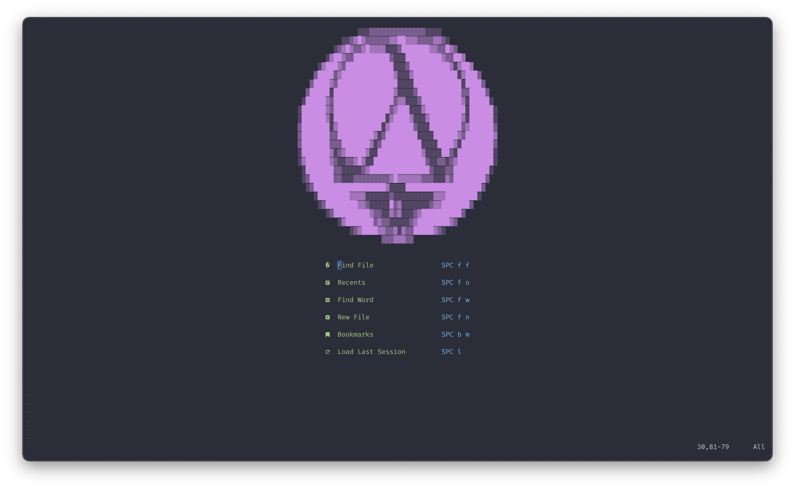

<label align="center">
  
</label>

## Configuration Structure 
```console
.
├── init.lua -- initialized when you open `nvim`
├── lua
│   ├── fun.lua
│   ├── plugins
│   │   ├── config -- specific plugin (depends on plugins installed with plugin manager)
│   │   │   ├── lsp 
│   │   │   │   ├── attach.lua 
│   │   │   │   ├── capabilities.lua
│   │   │   │   ├── cmp.lua
│   │   │   │   ├── init.lua
│   │   │   │   ├── reason.lua
│   │   │   │   └── setup.lua
│   │   │   ├── lualine.lua
│   │   │   └── treesitter.lua
│   │   ├── init.lua    -- list plugins
│   │   └── manager.lua -- bootstrap plugin manager (current use `packer`)
│   ├── settings
│   │   └── lsp  -- (Lsp settings depends on your language server)
│   │       └── sumneko_lua.lua
│   ├── settings.lua -- Default settings
│   └── utils.lua -- Configuration Utilities
└── plugin - Autogenerated when compile with packer (:PackerCompile)
    └── packer_compiled.lua
```
